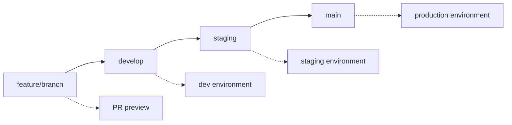

# GitHub Actions CI/CD Setup Guide

This document provides step-by-step instructions for setting up the comprehensive CI/CD pipeline for the Vigor fitness application.

## Overview

The CI/CD pipeline implements a progressive approach with the following features:

- **Security First**: Vulnerability scanning, dependency checks, code quality gates
- **Separate Jobs**: Backend and frontend isolated for parallel execution
- **Branch-based Deployment**: Different environments for different branches
- **Infrastructure as Code**: Terraform integration with Azure
- **Zero-downtime Deployment**: Blue-green deployment for production
- **Preview Environments**: Automatic PR preview deployments
- **Comprehensive Testing**: Unit tests, integration tests, security scans
- **Caching**: Dependency caching for faster builds
- **Error Handling**: Rollback strategies and health checks

## Architecture

```
┌─────────────────┐    ┌─────────────────┐    ┌─────────────────┐
│   Development   │    │     Staging     │    │   Production    │
│   (develop)     │    │   (staging)     │    │     (main)      │
├─────────────────┤    ├─────────────────┤    ├─────────────────┤
│ • Fast feedback │    │ • Pre-prod test │    │ • Blue-green    │
│ • Basic infra   │    │ • Full features │    │ • High availability│
│ • Single region │    │ • Load testing  │    │ • Multi-region  │
└─────────────────┘    └─────────────────┘    └─────────────────┘
```

## Required GitHub Secrets

### Azure Authentication

```bash
AZURE_CREDENTIALS                    # Service Principal JSON
AZURE_CLIENT_ID                     # Service Principal Client ID
AZURE_CLIENT_SECRET                 # Service Principal Secret
AZURE_TENANT_ID                     # Azure Tenant ID
AZURE_SUBSCRIPTION_ID               # Azure Subscription ID
```

### Application Secrets

```bash
SECRET_KEY                          # JWT secret key (32+ characters)
POSTGRES_ADMIN_PASSWORD             # Database admin password (8+ characters)
```

### AI Provider API Keys

```bash
OPENAI_API_KEY                      # OpenAI API key
GOOGLE_AI_API_KEY                   # Google AI/Gemini API key
PERPLEXITY_API_KEY                  # Perplexity API key
```

### Database Connection Strings

```bash
DATABASE_URL_DEV                    # Development database URL
DATABASE_URL_STAGING                # Staging database URL
DATABASE_URL_PRODUCTION             # Production database URL
```

### Static Web App Tokens

```bash
AZURE_STATIC_WEB_APPS_API_TOKEN_DEV        # Dev Static Web App token
AZURE_STATIC_WEB_APPS_API_TOKEN_STAGING    # Staging Static Web App token
AZURE_STATIC_WEB_APPS_API_TOKEN_PRODUCTION # Production Static Web App token
```

## Setup Instructions

### 1. Azure Service Principal Setup

Create a service principal with the necessary permissions:

```bash
# Create service principal
az ad sp create-for-rbac --name "vigor-cicd" --role "Contributor" --scopes "/subscriptions/YOUR_SUBSCRIPTION_ID"

# Output format for AZURE_CREDENTIALS secret:
{
  "clientId": "xxx",
  "clientSecret": "xxx",
  "subscriptionId": "xxx",
  "tenantId": "xxx"
}
```

### 2. Terraform Backend Setup

Initialize Terraform backend for state management:

```bash
# Create resource group for Terraform state
az group create --name vigor-tfstate-rg --location "East US"

# Create storage account
az storage account create \
  --resource-group vigor-tfstate-rg \
  --name vigortfstate$(date +%s) \
  --sku Standard_LRS \
  --encryption-services blob

# Create container
az storage container create \
  --name tfstate \
  --account-name vigortfstate$(date +%s)
```

### 3. GitHub Repository Configuration

#### Repository Settings

1. Go to your repository → Settings → Actions → General
2. Set "Workflow permissions" to "Read and write permissions"
3. Enable "Allow GitHub Actions to create and approve pull requests"

#### Environment Configuration

Create the following environments in GitHub:

- `development` (auto-deploy from develop branch)
- `staging` (auto-deploy from staging branch)
- `production` (requires manual approval)

#### Branch Protection Rules

```yaml
main:
  - Require status checks: ✓
  - Require branches to be up to date: ✓
  - Required status checks:
      - security-scan
      - backend-lint-test
      - frontend-lint-test
      - infrastructure-validate
  - Require pull request reviews: ✓
  - Dismiss stale reviews: ✓
  - Require review from code owners: ✓

develop:
  - Require status checks: ✓
  - Required status checks:
      - backend-lint-test
      - frontend-lint-test

staging:
  - Require status checks: ✓
  - Required status checks:
      - backend-lint-test
      - frontend-lint-test
      - infrastructure-validate
```

### 4. Azure Resources Setup

The pipeline will automatically create Azure resources, but you can pre-create them:

```bash
# Create resource groups
az group create --name vigor-dev-rg --location "East US"
az group create --name vigor-staging-rg --location "East US"
az group create --name vigor-production-rg --location "East US"

# Create container registry (shared across environments)
az acr create --resource-group vigor-dev-rg --name vigorregistry --sku Basic
```

## Pipeline Stages

### 1. Security & Quality Gates

- **Trivy Security Scan**: Vulnerability scanning for dependencies and container images
- **SARIF Upload**: Security findings uploaded to GitHub Security tab
- **Dependency Check**: Safety check for Python packages

### 2. Backend Pipeline

- **Lint & Format**: Black, isort, flake8 code quality checks
- **Security Scan**: Bandit security analysis
- **Testing**: pytest with coverage reporting
- **Build**: Docker image build and push to ACR
- **Caching**: pip dependencies cached for faster builds

### 3. Frontend Pipeline

- **Lint & Format**: ESLint and TypeScript checks
- **Testing**: Jest unit tests with coverage
- **Build**: Vite production build
- **Caching**: npm dependencies cached
- **Artifact Upload**: Build artifacts stored for deployment

### 4. Infrastructure Validation

- **Terraform Format**: Code formatting validation
- **Terraform Validate**: Configuration validation
- **Terraform Plan**: Deployment plan generation
- **Cost Estimation**: Infrastructure cost analysis

### 5. Environment Deployments

#### Development (develop branch)

- **Fast Deployment**: Basic infrastructure, single region
- **Container Instances**: Lightweight backend deployment
- **Static Web Apps**: Frontend deployment
- **Database Migration**: Automatic schema updates

#### Staging (staging branch)

- **Full Infrastructure**: Production-like environment
- **App Service**: Managed backend deployment
- **Load Testing**: Performance validation
- **Smoke Tests**: Basic functionality verification

#### Production (main branch)

- **Blue-Green Deployment**: Zero-downtime updates
- **Deployment Slots**: Staging slot for validation
- **Health Checks**: Comprehensive monitoring
- **Rollback Strategy**: Automatic rollback on failure

#### Preview (Pull Requests)

- **Temporary Environment**: PR-specific deployments
- **Container Instances**: Isolated testing environment
- **Automatic Cleanup**: Resources cleaned up on PR close
- **PR Comments**: Preview URLs automatically commented

## Branch Strategy



## Monitoring & Observability

### Application Insights

- Performance monitoring
- Error tracking
- User analytics
- Custom metrics

### Log Analytics

- Centralized logging
- Query and analysis
- Alerting rules
- Dashboards

### Health Checks

- `/health` endpoint monitoring
- Database connectivity checks
- External service availability
- Performance metrics

## Security Considerations

### Secrets Management

- All secrets stored in GitHub Secrets
- Environment-specific secret scoping
- Azure Key Vault integration for production
- Rotation policies for API keys

### Network Security

- Virtual Network integration
- Private endpoints for databases
- Web Application Firewall
- SSL/TLS termination

### Identity & Access

- Managed Identity for Azure resources
- Role-based access control (RBAC)
- Service Principal with minimal permissions
- Audit logging enabled

## Cost Optimization

### Development Environment

- Basic tier App Service (B1)
- Minimal Redis cache (250MB)
- Single region deployment
- $50/month budget alert

### Staging Environment

- Standard tier App Service (S1)
- Standard Redis cache (1GB)
- High availability enabled
- $200/month budget alert

### Production Environment

- Premium tier App Service (P1V2)
- Premium Redis cache (6GB)
- Multi-region deployment
- Auto-scaling enabled
- $1000/month budget alert

## Troubleshooting

### Common Issues

#### 1. Authentication Failures

```bash
# Verify service principal
az ad sp show --id YOUR_CLIENT_ID

# Check role assignments
az role assignment list --assignee YOUR_CLIENT_ID
```

#### 2. Terraform State Issues

```bash
# Reinitialize Terraform backend
cd infrastructure/terraform
terraform init -reconfigure
```

#### 3. Docker Build Failures

```bash
# Test local build
cd backend
docker build -t vigor-backend .
docker run -p 8000:8000 vigor-backend
```

#### 4. Database Connection Issues

```bash
# Test connection
az postgres flexible-server connect -n YOUR_SERVER_NAME -u vigoradmin -d vigor
```

## Performance Optimization

### Build Performance

- **Dependency Caching**: pip and npm caches enabled
- **Docker Layer Caching**: Multi-stage builds optimized
- **Parallel Jobs**: Backend and frontend build in parallel
- **Artifact Sharing**: Build artifacts cached between jobs

### Deployment Performance

- **Container Registry**: Regional proximity for faster pulls
- **CDN Integration**: Static assets served from edge locations
- **Database Optimization**: Connection pooling and indexing
- **Redis Caching**: Application-level caching enabled

## Maintenance

### Regular Tasks

- **Dependency Updates**: Automated via Dependabot
- **Security Patches**: Weekly vulnerability scans
- **Backup Verification**: Monthly backup restoration tests
- **Performance Reviews**: Quarterly performance analysis

### Monitoring

- **Pipeline Success Rate**: Track deployment success metrics
- **Build Time Trends**: Monitor for performance degradation
- **Cost Analysis**: Monthly cost review and optimization
- **Security Compliance**: Quarterly security audits

## Next Steps

1. **Enhanced Testing**: Add integration tests and end-to-end tests
2. **Performance Testing**: Implement load testing with Azure Load Testing
3. **Chaos Engineering**: Add chaos engineering tests for resilience
4. **Multi-region**: Expand to multiple Azure regions for production
5. **GitOps**: Consider ArgoCD or Flux for GitOps deployment patterns
