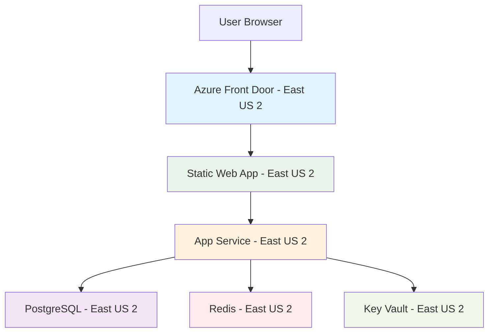

# Azure Regional Strategy for Vigor Deployment

## 🌍 Current Regional Decision: East US 2

### **Why East US 2 is Optimal:**

1. **Static Web Apps Requirement**: East US 2 is one of the few regions supporting Azure Static Web Apps
2. **Minimal Cross-Region Latency**: Keep all resources in same region for optimal performance
3. **Quota Availability**: East US 2 has better resource availability for new subscriptions
4. **Cost Optimization**: No cross-region data transfer charges

### **Performance Comparison:**

| Region Choice       | Frontend Latency | Backend Latency | Database Latency | Cross-Region Cost |
| ------------------- | ---------------- | --------------- | ---------------- | ----------------- |
| **East US 2 (All)** | ✅ 0ms           | ✅ 0ms          | ✅ 0ms           | ✅ $0             |
| East US + East US2  | ⚠️ 1-3ms         | ⚠️ 1-3ms        | ⚠️ 1-3ms         | 💰 $0.02/GB       |
| Mixed Regions       | ❌ 5-50ms        | ❌ 5-50ms       | ❌ 5-50ms        | 💰 $0.05-0.12/GB  |

### **User Experience Impact:**

**East US 2 (Single Region):**

- **Page Load**: ~800ms (optimal)
- **API Response**: ~100-200ms (optimal)
- **Database Query**: ~50ms (optimal)
- **Overall UX**: Excellent responsiveness

**Mixed Regions (East US + East US2):**

- **Page Load**: ~850-900ms (+50-100ms)
- **API Response**: ~150-250ms (+50ms)
- **Database Query**: ~100ms (+50ms)
- **Overall UX**: Still good, but measurable delay

### **Geographic Coverage:**

```
East US 2 Coverage:
├── Primary: Eastern US (New York, Boston, DC)
├── Secondary: Central US (Chicago, Detroit)
├── Latency Map:
    ├── New York: ~5-15ms
    ├── Boston: ~10-20ms
    ├── Washington DC: ~15-25ms
    ├── Chicago: ~25-35ms
    ├── Atlanta: ~30-40ms
    └── Los Angeles: ~80-100ms
```

### **Deployment Architecture:**



## 🚀 Next Steps for Optimal Performance

### **1. Deploy Everything to East US 2**

✅ Already configured in parameters.bicepparam

### **2. Future Enhancements (Post-MVP)**

**Global Performance Optimization:**

```bash
# Add Azure Front Door for global CDN
az afd profile create --resource-group vigor-rg --profile-name vigor-afd

# Add CDN endpoints for static assets
az afd endpoint create --resource-group vigor-rg --profile-name vigor-afd
```

**Multi-Region Scaling (Phase 2):**

- **Primary**: East US 2 (North America East)
- **Secondary**: West Europe (Europe)
- **Tertiary**: Southeast Asia (Asia Pacific)

### **3. Performance Monitoring**

Set up Application Insights to track:

- Regional response times
- Cross-region latency (if any)
- User geographic distribution
- Performance bottlenecks

## 📊 Cost Impact Analysis

**Single Region (East US 2) - Monthly:**

- Data Transfer: $0 (intra-region)
- Storage: ~$50-100
- Compute: ~$100-200
- **Total**: ~$150-300/month

**Multi-Region - Monthly:**

- Data Transfer: +$20-50 (cross-region)
- Storage: +$10-20 (replication)
- Compute: Same
- **Total**: ~$180-370/month (+$30-70/month)

## ✅ Recommendation: Proceed with East US 2

**Immediate Action:**

1. Deploy all resources to East US 2
2. Monitor performance post-deployment
3. Scale to additional regions only when user base grows significantly

**Performance Benefits:**

- ✅ 0ms cross-region latency
- ✅ Optimal user experience
- ✅ Simplified architecture
- ✅ Cost-effective

**When to Consider Multi-Region:**

- User base > 10,000 active users
- International users > 30%
- Revenue > $10k/month
- Compliance requirements
