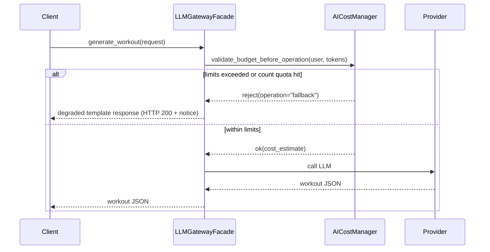

# Vigor - Technical Specification Document

**Version**: 1.0
**Date**: June 26, 2025
**Status**: Production Ready
**Document Owner**: Engineering Team
**Aligned with**: PRD-Vigor.md v1.0, User_Experience.md v1.0

---

## Executive Summary

This Technical Specification defines the implementation details for Vigor, an AI-powered fitness platform built with modern serverless architecture. The system implements Clean/Hexagonal Architecture with a unified resource group strategy for Azure deployment, enabling automatic scaling and cost optimization (≤$50/month operational ceiling).

**Key Architectural Decisions:**

- **Clean Architecture**: Domain-driven design with clear separation of concerns
- **Single AI Provider**: Azure OpenAI gpt-5-mini (deployed in vigor-rg) for streamlined, cost-effective AI operations
- **Serverless Infrastructure**: Azure Functions with Flex Consumption Plan for optimal cost efficiency
- **Modern Database**: Cosmos DB for global scale and automatic scaling
- **Unified Resource Group**: Single `vigor-rg` for simplified management

---

## 1. System Architecture Overview

### 1.1 High-Level Architecture

```
┌─────────────────────┐    ┌──────────────────────┐    ┌─────────────────────┐
│   React Frontend    │───▶│  Azure Functions     │───▶│  Azure OpenAI       │
│   (TypeScript +     │    │  (Serverless API)    │    │  (gpt-5-mini)       │
│   Chakra UI)        │    │                      │    │                     │
└─────────────────────┘    └──────────────────────┘    └─────────────────────┘
           │                          │                          │
           │                          ▼                          │
           │                ┌──────────────────────┐             │
           │                │    Cosmos DB         │             │
           │                │   (NoSQL Database)   │             │
           │                │                      │             │
           │                └──────────────────────┘             │
           │                                                     │
           ▼                                                     ▼
┌─────────────────────┐                              ┌─────────────────────┐
│   Azure Static      │                              │   Azure Key Vault   │
│   Web App           │                              │   (API Keys &       │
│   (CDN + PWA)       │                              │   Secrets)          │
└─────────────────────┘                              └─────────────────────┘
```

### 1.2 Infrastructure Architecture

**Unified Resource Group Strategy:**

```
┌─────────────────────────────────────────────────────────────────────┐
│                           vigor-rg (All Resources)                  │
│  ┌─────────────────┐  ┌─────────────────┐  ┌─────────────────┐     │
│  │ Azure Functions │  │ Static Web App  │  │ Application     │     │
│  │ (Serverless API)│  │ (Frontend)      │  │ Insights        │     │
│  └─────────────────┘  └─────────────────┘  └─────────────────┘     │
│  ┌─────────────────┐  ┌─────────────────┐                         │
│  │    Cosmos DB    │  │  Azure Key      │                         │
│  │   (NoSQL DB)    │  │     Vault       │                         │
│  └─────────────────┘  └─────────────────┘                         │
│              - Estimated Cost: ~$30-50/month                       │
└─────────────────────────────────────────────────────────────────────┘
```

│ │ PostgreSQL │ │ Azure Key │ │ Storage │ │
│ │ Database │ │ Vault │ │ Account │ │
│ └─────────────────┘ └─────────────────┘ └─────────────────┘ │
└─────────────────────────────────────────────────────────────────────┘
(ALWAYS PERSISTENT)

```

---

## 2. Backend Architecture

### 2.1 Serverless Architecture Implementation

The backend follows Clean/Hexagonal Architecture with Azure Functions:

```

functions/
├── ai/ # AI-related functions
│ ├── workout_generation/ # Workout plan generation
│ ├── coach_chat/ # AI coaching conversations
│ └── progress_analysis/ # User progress insights
├── api/ # HTTP trigger functions
│ ├── auth/ # Authentication endpoints
│ ├── users/ # User management
│ └── workouts/ # Workout operations
├── shared/ # Shared code and utilities
│ ├── models/ # Pydantic domain models
│ ├── database/ # Cosmos DB client
│ └── ai/ # OpenAI client
└── requirements.txt # Function dependencies

`````

### 2.2 Technology Stack

#### Core Framework

- **Azure Functions v4**: Serverless compute with HTTP/Timer triggers
- **Python 3.11+**: Azure Functions supported Python runtime
- **Flex Consumption Plan**: Pay-per-execution with automatic scaling
- **Pydantic v2**: Data validation and serialization

#### Database & Data Access

- **Cosmos DB**: NoSQL database with global distribution
- **Azure Cosmos Python SDK**: Official SDK for database operations
- **JSON Document Store**: Native JSON support for flexible schemas
- **Auto-scaling**: Automatic RU scaling based on usage

#### Security & Authentication

- **Microsoft Entra ID**: Default tenant authentication provider
- **Email-based identification**: User email address as primary key for user records
- **JWKS Validation**: Microsoft Entra ID JWT token validation with caching
- **SlowAPI**: Rate limiting with Redis/memory backend
- **CORS middleware**: Cross-origin request handling
- **Auto user creation**: Automatic database entry creation for authenticated users
- **Simplified architecture**: Single resource group deployment

### 2.3 LLM System

#### Architecture Components

The LLM system uses Azure OpenAI (deployed in vigor-rg) with gpt-5-mini:

```python
# Azure OpenAI client for AI operations
from openai import AzureOpenAI

class AzureOpenAIClient:
    def __init__(self, endpoint: str, api_key: str, deployment: str):
        self._client = AzureOpenAI(
            azure_endpoint=endpoint,
            api_key=api_key,
            api_version="2024-02-01"
        )
        self._deployment = deployment  # "gpt-5-mini"
        self._budget_manager = BudgetManager()
        self._cache_manager = CacheManager()
```

#### Single Provider Configuration

| Provider               | Use Cases                                        | Cost/1M Tokens |
| ---------------------- | ------------------------------------------------ | -------------- |
| Azure OpenAI gpt-5-mini | Workout generation, coaching, progress analysis | ~$0.15-0.60    |

#### Key Features

- **Budget Management**: Real-time cost tracking and enforcement
- **Response Caching**: TTL-based caching for cost optimization
- **Request Validation**: Input sanitization and user context injection
- **Analytics**: Comprehensive usage tracking and performance metrics

### 2.4 Database Schema (Cosmos DB)

#### Container Structure

```json
{
  "users": {
    "partitionKey": "/userId",
    "items": [
      {
        "id": "user_12345",
        "userId": "user_12345",
        "email": "user@example.com",
        "username": "john_doe",
        "profile": {
          "fitnessLevel": "intermediate",
          "goals": ["strength", "endurance"],
          "equipment": "home_gym",
          "tier": "free"
        },
        "preferences": {
          "workoutDuration": 45,
          "restDays": ["sunday"],
          "notifications": true
        },
        "createdAt": "2025-01-01T00:00:00Z",
        "updatedAt": "2025-01-01T00:00:00Z",
        "_ts": 1704067200
      }
    ]
  },
  "workouts": {
    "partitionKey": "/userId",
    "items": [
      {
        "id": "workout_67890",
        "userId": "user_12345",
        "name": "Upper Body Strength",
        "description": "AI-generated upper body workout",
        "exercises": [
          {
            "name": "Push-ups",
            "sets": 3,
            "reps": 12,
            "duration": null,
            "restTime": 60,
            "equipment": "bodyweight"
          }
        ],
        "metadata": {
          "difficulty": "intermediate",
          "estimatedDuration": 45,
          "equipmentNeeded": ["none"],
          "aiProviderUsed": "openai-gpt-5-mini"
        },
        "createdAt": "2025-01-01T10:00:00Z",
        "_ts": 1704103200
      }
    ]
  },
  "workout_logs": {
    "partitionKey": "/userId",
    "items": [
      {
        "id": "log_11111",
        "userId": "user_12345",
        "workoutPlanId": "workout_67890",
        "exercisesCompleted": [
          {
            "exerciseName": "Push-ups",
            "completedSets": 3,
            "actualReps": [12, 10, 8],
            "notes": "Felt strong today"
          }
        ],
        "durationMinutes": 42,
        "intensity": 8,
        "notes": "Great workout, increased reps",
        "completedAt": "2025-01-01T18:00:00Z",
        "_ts": 1704132000
      }
    ]
  },
  "ai_coach_messages": {
    "partitionKey": "/userId",
    "items": [
      {
        "id": "msg_22222",
        "userId": "user_12345",
        "role": "user",
        "content": "How should I modify my workout for better results?",
        "providerUsed": "openai-gpt-5-mini",
        "tokensUsed": 150,
        "responseTimeMs": 850,
        "createdAt": "2025-01-01T19:00:00Z",
        "_ts": 1704135600
      }
    ]
  }
}
```

#### Data Models (Python)

````python
#### Data Models (Python)

```python
# User and Authentication (Cosmos DB Document)
class UserProfile(BaseModel):
    id: str                           # Document ID
    userId: str                       # Partition key
    email: str                        # Unique email
    username: str                     # Unique username
    profile: UserProfileData
    preferences: UserPreferences
    createdAt: datetime
    updatedAt: datetime

class UserProfileData(BaseModel):
    fitnessLevel: FitnessLevel       # BEGINNER, INTERMEDIATE, ADVANCED
    goals: List[FitnessGoal]         # Multiple fitness objectives
    equipment: Equipment             # Available equipment level
    tier: UserTier                   # FREE (MVP), ADMIN (PREMIUM post-MVP)

# Workout System (Cosmos DB Documents)
class WorkoutPlan(BaseModel):
    id: str                          # Document ID
    userId: str                      # Partition key
    name: str                        # AI-generated name
    description: str                 # Workout overview
    exercises: List[Exercise]        # Structured exercise data
    metadata: WorkoutMetadata
    createdAt: datetime

class WorkoutMetadata(BaseModel):
    difficulty: str                  # Calculated difficulty
    estimatedDuration: int           # Planned duration in minutes
    equipmentNeeded: List[str]       # Required equipment
    aiProviderUsed: str             # Always "openai-gpt-5-mini"

class WorkoutLog(BaseModel):
    id: str                          # Document ID
    userId: str                      # Partition key
    workoutPlanId: str              # Reference to WorkoutPlan
    exercisesCompleted: List[ExerciseLog]
    durationMinutes: int             # Actual duration
    intensity: int                   # 1-10 user rating
    notes: str                       # User notes
    completedAt: datetime

# AI System (Cosmos DB Documents)
class AICoachMessage(BaseModel):
    id: str                          # Document ID
    userId: str                      # Partition key
    role: str                        # 'user' or 'assistant'
    content: str                     # Message content
    providerUsed: str               # Always "openai-gpt-5-mini"
    tokensUsed: int                 # Cost tracking
    responseTimeMs: int             # Performance tracking
    createdAt: datetime
`````

#### Indexing and Performance

- **Automatic Indexing**: Cosmos DB indexes all properties by default
- **Partition Strategy**: All data partitioned by `userId` for optimal query performance
- **TTL Policies**: Automatic cleanup of old AI messages and temporary data
- **Change Feed**: Real-time processing for analytics and notifications

# Budget and Usage Tracking

class BudgetSettings:
id: str # UUID
user_id: str # FK to UserProfile (or global)
monthly_limit: Decimal # Budget limit in USD
current_usage: Decimal # Current month spending
alert_threshold: float # Alert at % of budget
auto_disable: bool # Auto-disable when exceeded
created_at: datetime
updated_at: datetime

````

#### Key Relationships

```sql
-- Foreign Keys and Indexes
ALTER TABLE workout_plans ADD CONSTRAINT fk_workout_plans_user
    FOREIGN KEY (user_id) REFERENCES user_profiles(id);

ALTER TABLE workout_logs ADD CONSTRAINT fk_workout_logs_user
    FOREIGN KEY (user_id) REFERENCES user_profiles(id);

ALTER TABLE ai_coach_messages ADD CONSTRAINT fk_ai_messages_user
    FOREIGN KEY (user_id) REFERENCES user_profiles(id);

-- Performance Indexes
CREATE INDEX idx_workout_logs_user_date ON workout_logs(user_id, completed_at);
CREATE INDEX idx_ai_messages_user_date ON ai_coach_messages(user_id, created_at);
CREATE INDEX idx_workout_plans_user ON workout_plans(user_id);
````

### 2.5 API Layer (Azure Functions)

#### Function App Structure

```python
# HTTP Trigger Functions for API endpoints
import azure.functions as func
from azure.functions import FunctionApp

app = FunctionApp(http_auth_level=func.AuthLevel.FUNCTION)

# Authentication & User Management
@app.route(route="auth/login", methods=["POST"])
@limiter.limit("10/minute")
async def login(req: func.HttpRequest) -> func.HttpResponse:
    """Authenticate user via Microsoft Entra ID default tenant"""

@app.route(route="auth/me", methods=["GET"])
async def get_current_user(req: func.HttpRequest) -> func.HttpResponse:
    """Get current user profile using VedUser standard interface"""
    current_user = await get_current_user_from_token(req)
    return func.HttpResponse(json.dumps(current_user.dict()))

@app.route(route="auth/logout", methods=["POST"])
async def logout(req: func.HttpRequest) -> func.HttpResponse:
    """Logout user (stateless - handled client-side)"""

# User Profile Management
@app.route(route="users/profile", methods=["GET", "PUT"])
async def user_profile(req: func.HttpRequest) -> func.HttpResponse:
    """Get or update user profile stored in Cosmos DB"""
    current_user = await get_current_user_from_token(req)

    if req.method == "GET":
        profile = await cosmos_db.get_user_profile(current_user.user_id)
        return func.HttpResponse(json.dumps(profile))
    elif req.method == "PUT":
        profile_data = req.get_json()
        updated_profile = await cosmos_db.update_user_profile(
            current_user.user_id, profile_data
        )
        return func.HttpResponse(json.dumps(updated_profile))
```

#### AI-Powered Workout Functions

```python
# Workout Generation with OpenAI gpt-5-mini
@app.route(route="workouts/generate", methods=["POST"])
@limiter.limit("50/day")  # Generous for early adopters
async def generate_workout(req: func.HttpRequest) -> func.HttpResponse:
    """Generate personalized workout using OpenAI gpt-5-mini"""""
    current_user = await get_current_user_from_token(req)
    workout_request = req.get_json()

    # Validate budget before AI operation
    budget_check = await validate_ai_budget(current_user.user_id)
    if not budget_check.approved:
        return func.HttpResponse(
            json.dumps({"error": "AI budget exceeded"}),
            status_code=429
        )

    # Generate workout with OpenAI
    workout = await openai_client.generate_workout(
        user_profile=current_user.profile,
        preferences=workout_request
    )

    # Store in Cosmos DB
    saved_workout = await cosmos_db.create_workout(
        user_id=current_user.user_id,
        workout_data=workout
    )

    return func.HttpResponse(json.dumps(saved_workout))

# AI Coach Chat
@app.route(route="ai/coach/chat", methods=["POST"])
@limiter.limit("50/day")  # Generous for early adopters
async def coach_chat(req: func.HttpRequest) -> func.HttpResponse:
    """Chat with AI coach using OpenAI gpt-5-mini"""
    current_user = await get_current_user_from_token(req)
    message_data = req.get_json()

    # Get conversation history from Cosmos DB
    conversation_history = await cosmos_db.get_conversation_history(
        current_user.user_id, limit=10
    )

    # Generate response with OpenAI
    ai_response = await openai_client.generate_coach_response(
        user_message=message_data["message"],
        conversation_history=conversation_history,
        user_context=current_user.profile
    )

    # Save both messages to Cosmos DB
    await cosmos_db.save_chat_messages([
        {"role": "user", "content": message_data["message"]},
        {"role": "assistant", "content": ai_response}
    ], user_id=current_user.user_id)

    return func.HttpResponse(json.dumps({"response": ai_response}))
```

#### Cost Management & Monitoring

```python
# Real-time Cost Monitoring
@router.get("/admin/ai/costs/real-time")
async def get_real_time_costs(
    admin_user: UserResponse = Depends(require_admin)
) -> CostMonitoringResponse:
    """Get real-time AI cost metrics and budget utilization"""

@router.post("/ai/budget/validate")
@limiter.limit("100/minute")
async def validate_budget_before_operation(
    operation: BudgetValidationRequest,
    current_user: UserResponse = Depends(get_current_user_entra)
) -> BudgetValidationResponse:
    """Validate budget before expensive AI operations"""

# Automated Cost Management
@router.post("/admin/ai/cost-management/configure")
async def configure_cost_management(
    config: CostManagementConfig,
    admin_user: UserResponse = Depends(require_admin)
) -> ConfigurationResponse:
    """Configure automated cost management rules and thresholds"""

@router.post("/ai/model/switch")
async def trigger_dynamic_model_switch(
    switch_request: ModelSwitchRequest,
    admin_user: UserResponse = Depends(require_admin)
) -> ModelSwitchResponse:
    """Execute dynamic model switching for cost optimization"""

# Cost Analytics and Forecasting
@router.get("/admin/ai/costs/analytics")
async def get_cost_analytics(
    time_range: str = "30d",
    admin_user: UserResponse = Depends(require_admin)
) -> CostAnalyticsResponse:
    """Get detailed cost analytics and forecasting data"""

@router.get("/admin/ai/costs/per-user")
async def get_per_user_costs(
    admin_user: UserResponse = Depends(require_admin)
) -> PerUserCostResponse:
    """Get per-user AI cost breakdown and usage patterns"""
```

#### Core Endpoints

```python
# AI Workflow Endpoints
@router.post("/ai/workout-plan")
@limiter.limit("30/minute")
async def generate_workout_plan(
    request: WorkoutPlanRequest,
    current_user: UserResponse = Depends(get_current_user)
) -> WorkoutPlanResponse:
    """Generate personalized workout using LLM orchestration"""

@router.post("/ai/chat")
@limiter.limit("60/minute")
async def chat_with_coach(
    message: ChatRequest,
    current_user: UserResponse = Depends(get_current_user)
) -> ChatResponse:
    """Conversational AI coaching interface"""

# Workout Management
@router.post("/workouts/logs")
async def log_workout(
    workout_log: WorkoutLogCreate,
    current_user: UserResponse = Depends(get_current_user)
) -> WorkoutLogResponse:
    """Log completed workout with analytics"""

@router.get("/workouts/logs")
async def get_workout_history(
    current_user: UserResponse = Depends(get_current_user),
    limit: int = 50
) -> List[WorkoutLogResponse]:
    """Get user's workout history with pagination"""
```

#### Admin & Monitoring

```python
# LLM Administration
@router.get("/llm/status")
async def get_llm_status() -> SystemStatusResponse:
    """Get LLM provider health and performance metrics"""

@router.post("/llm/admin/models")
async def configure_model(
    config: ModelConfiguration,
    admin_user: UserResponse = Depends(require_admin)
) -> ConfigurationResponse:
    """Configure LLM provider settings (admin only)"""

# System Health
@router.get("/health")
@limiter.limit("100/minute")
async def health_check() -> HealthResponse:
    """System health check with dependency validation"""
```

#### Admin Extensions

```python
@router.post("/admin/limits/override")
async def override_limits(
    override: LimitOverrideRequest,
    admin_user: UserResponse = Depends(require_admin)
) -> OverrideResponse:
    """Temporarily adjust or bypass any quota/budget for troubleshooting or VIP support."""
```

---

## 3. Frontend Architecture

### 3.1 Technology Stack

#### Core Framework

- **React 19**: Latest React with server components and improved performance
- **TypeScript 5**: Strong typing for better developer experience
- **Vite**: Fast build tool with HMR and optimized bundling
- **Chakra UI v3**: Accessible component library with consistent design

#### State Management

- **Zustand**: Lightweight state management for global state
- **React Context**: Authentication and user session management
- **TanStack Query**: Server state management and caching
- **React Hook Form**: Form state and validation

#### Routing & Navigation

- **React Router v6**: Client-side routing with nested routes
- **Protected Routes**: Authentication-aware route protection
- **Layout Components**: Consistent navigation and layout structure

### 3.2 Application Structure

```
frontend/src/
├── components/              # Reusable UI components
│   ├── Layout.tsx          # Main layout with sidebar
│   ├── ProtectedRoute.tsx  # Route protection wrapper
│   ├── LLMStatus.tsx       # AI system status display
│   └── QuickReplies.tsx    # Support interface components
├── pages/                   # Route-level components
│   ├── DashboardPage.tsx   # Main user dashboard
│   ├── WorkoutPage.tsx     # Workout generation and tracking
│   ├── CoachPage.tsx       # AI coach chat interface
│   ├── AdminPage.tsx       # Admin management console
│   └── LLMOrchestrationPage.tsx # LLM system management
├── contexts/                # React context providers
│   ├── AuthContext.tsx     # Authentication state
│   └── useAuth.ts          # Authentication hook
├── services/                # API communication
│   ├── authService.ts      # Authentication API calls
│   ├── workoutService.ts   # Workout-related API calls
│   ├── adminService.ts     # Admin management API calls
│   └── supportService.ts   # Support functionality
├── stores/                  # Zustand state stores
│   └── chatStore.ts        # Chat state management
├── types/                   # TypeScript type definitions
│   ├── auth.ts             # Authentication types
│   ├── workout.ts          # Workout-related types
│   └── admin.ts            # Admin interface types
└── utils/                   # Utility functions
    └── streak.ts           # Streak calculation utilities
```

### 3.3 Key Components Implementation

#### Authentication System

```typescript
// AuthContext.tsx - Global authentication state
interface AuthContextType {
  user: User | null;
  isLoading: boolean;
  login: (email: string, password: string) => Promise<void>;
  register: (email: string, username: string, password: string) => Promise<void>;
  logout: () => void;
  isAuthenticated: boolean;
}

export const AuthProvider: React.FC<AuthProviderProps> = ({ children }) => {
  const [user, setUser] = useState<User | null>(null);
  const [isLoading, setIsLoading] = useState(true);

  // Token validation and auto-refresh logic
  useEffect(() => {
    const checkAuthStatus = async () => {
      const token = localStorage.getItem('accessToken');
      if (token) {
        try {
          const userData = await authService.getCurrentUser();
          setUser(userData);
        } catch (error) {
          localStorage.removeItem('accessToken');
          localStorage.removeItem('refreshToken');
        }
      }
      setIsLoading(false);
    };
    checkAuthStatus();
  }, []);
```

#### Layout and Navigation

```typescript
// Layout.tsx - Main application layout
export const Layout = () => {
  const { user, logout } = useAuth();
  const location = useLocation();

  const Links = [
    { name: "Dashboard", path: "/" },
    { name: "Workouts", path: "/workouts" },
    { name: "AI Coach", path: "/coach" },
    { name: "Profile", path: "/profile" },
  ];

  return (
    <Flex minH="100vh" bg="gray.50">
      {/* Responsive Sidebar */}
      <Box bg="white" w="250px" p={6} display={{ base: "none", md: "block" }}>
        <Heading size="lg" color="blue.500" mb={8}>
          Vigor
        </Heading>
        {/* Navigation Links */}
      </Box>

      {/* Main Content */}
      <Box flex="1">
        <Outlet />
      </Box>
    </Flex>
  );
};
```

#### AI Coach Interface

```typescript
// CoachPage.tsx - AI coaching interface
export const CoachPage = () => {
  const [messages, setMessages] = useState<Message[]>([]);
  const [inputMessage, setInputMessage] = useState('');
  const [isLoading, setIsLoading] = useState(false);

  const sendMessage = async () => {
    if (!inputMessage.trim()) return;

    const userMessage: Message = {
      role: 'user',
      content: inputMessage,
      timestamp: new Date()
    };

    setMessages(prev => [...prev, userMessage]);
    setIsLoading(true);

    try {
      const response = await fetch('/api/ai/chat', {
        method: 'POST',
        headers: {
          'Content-Type': 'application/json',
          'Authorization': `Bearer ${token}`
        },
        body: JSON.stringify({
          message: inputMessage,
          context: { page: 'coach' }
        })
      });

      const aiResponse = await response.json();
      setMessages(prev => [...prev, {
        role: 'assistant',
        content: aiResponse.content,
        timestamp: new Date()
      }]);
    } catch (error) {
      console.error('Error sending message:', error);
    } finally {
      setIsLoading(false);
    }
  };
```

### 3.4 Build and Deployment

#### Development Configuration

```typescript
// vite.config.ts
export default defineConfig({
  plugins: [react()],
  server: {
    port: 5173,
    proxy: {
      "/api": {
        target: "http://localhost:8000",
        changeOrigin: true,
        rewrite: (path) => path.replace(/^\/api/, ""),
      },
    },
  },
  build: {
    outDir: "dist",
    sourcemap: false,
    rollupOptions: {
      output: {
        manualChunks: {
          vendor: ["react", "react-dom"],
          router: ["react-router-dom"],
          ui: ["@chakra-ui/react"],
          query: ["@tanstack/react-query"],
        },
      },
    },
  },
});
```

#### Progressive Web App (PWA)

- **Service Worker**: Workbox-based caching for offline functionality
- **Manifest**: Native app-like installation capabilities
- **Push Notifications**: Web Push API for user engagement
- **Offline Support**: Critical UI components work without connectivity

---

## 4. Enhanced AI Cost Management & Automation

### 4.1 Real-Time Cost Tracking Architecture

The AI Cost Management system implements comprehensive cost tracking, budget validation, and automated optimization to maintain operational costs within budget ceiling (≤$100/month).

#### Core Components:

- **Real-time token usage tracking** for all Azure OpenAI operations
- **Budget validation** before expensive LLM operations
- **Intelligent caching layer** using Python functools.lru_cache for RAG responses
- **Dynamic fallback mechanisms** for budget constraints
- **Cost-effective model management** with OpenAI gpt-5-mini as primary
- **Request batching and query deduplication** for cost optimization
- **Graceful degradation** with user notification system
- **AI cost forecasting** and budget planning tools
- **Per-user AI usage limits** with enforcement and override capabilities
- **Azure Cost Management API integration** for automated alerts and throttling

### 4.2 Implementation Overview

```python
from functools import lru_cache
from azure.mgmt.consumption import ConsumptionManagementClient
from azure.identity import DefaultAzureCredential

class AICostManager:
    def __init__(self):
        self.credential = DefaultAzureCredential()
        self.consumption_client = ConsumptionManagementClient(
            credential=self.credential,
            subscription_id=os.getenv("AZURE_SUBSCRIPTION_ID")
        )
        self.budget_limits = {
            "monthly_total": 100.00,
            "per_user_free": 0.10,
            "per_user_premium": 2.00
        }

    async def validate_budget_before_operation(self, operation_type: str, estimated_tokens: int, user_id: str):
        """Validate budget before expensive operations"""
        # Implementation details in next section
        pass

    @lru_cache(maxsize=1000, typed=True)
    async def get_cached_ai_response(self, prompt_hash: str, model: str):
        """Intelligent caching layer for AI responses"""
        # Implementation details in next section
        pass
```

### 4.1 Budget-Enforcement Flow (illustrative)



#### Implementation snippet (illustrative)

```python
class BudgetDecision(Enum):
    OK = "ok"              # proceed as-is
    DOWNGRADE = "downgrade"  # switch to cheaper model
    DENY = "deny"            # use local template / fallback

async def validate_budget_before_operation(user: VedUser, tokens: int) -> BudgetDecision:
    if exceeds_count_quota(user):
        return BudgetDecision.DENY
    if exceeds_dollar_budget(tokens):
        return BudgetDecision.DOWNGRADE
    return BudgetDecision.OK

# In LLMGatewayFacade
result = await cost_mgr.validate_budget_before_operation(user, est_tokens)
if result == BudgetDecision.OK:
    response = call_primary_provider()
elif result == BudgetDecision.DOWNGRADE:
    response = call_cheaper_provider()
else:  # DENY
    response = generate_local_template()
return response
```

### 4.2 API Request/Response Schemas

#### Cost Management Configuration

```python
class OffPeakScaling(BaseModel):
    enabled: bool = True
    hours: str = "02:00-06:00 UTC"
    model_downgrade: bool = True

class PerUserLimits(BaseModel):
    """Count-based quotas; None = unlimited (e.g. premium tier)."""
    free_tier_monthly_chats: int = 10
    free_tier_monthly_workout_plans: int = 5
    premium_tier_monthly_chats: Optional[int] = None
    premium_tier_monthly_workout_plans: Optional[int] = None

class CostManagementConfig(BaseModel):
    auto_throttling_enabled: bool = True
    budget_threshold_alert: int = 80
    auto_fallback_threshold: int = 90
    off_peak_scaling: OffPeakScaling
    per_user_limits: PerUserLimits
```

---

## 5. Infrastructure & DevOps

### 5.1 Azure Cloud Architecture

#### Resource Configuration

```yaml
# Resource Groups Structure
vigor-rg: # Compute resources (deletable)
  - App Service Plan (B1) # ~$13/month
  - App Service (Backend) # Included in plan
  - Static Web App (Free) # $0/month
  - Application Insights # ~$2/month
  - Log Analytics Workspace # ~$3/month
  - AI/LLM Services # ~$55/month

vigor-db-rg: # Persistent resources (permanent)
  - PostgreSQL Flexible # ~$25/month
  - Azure Key Vault # ~$3/month
  - Storage Account (LRS) # ~$2/month
```

**Total Monthly Budget Ceiling**: ≤$100/month
**Pause Mode Cost**: ~$70/month (delete vigor-rg, keep vigor-db-rg)

#### Bicep Infrastructure as Code

```bicep
// main.bicep - Dual resource group deployment
param databaseResourceGroup string = 'vigor-db-rg'
param useDirectDeployment bool = true

// Compute resources in main RG
resource appServicePlan 'Microsoft.Web/serverfarms@2023-01-01' = {
  name: 'vigor-app-plan'
  location: location
  sku: { name: 'B1' }  // Cost-optimized tier
  kind: 'linux'
  properties: { reserved: true }
}

// Database resources in separate RG for persistence
module db './db.bicep' = {
  name: 'dbModule'
  scope: resourceGroup(databaseResourceGroup)
  params: {
    postgresServerName: 'vigor-db-server'
    postgresAdminUsername: postgresAdminUsername
    postgresAdminPassword: postgresAdminPassword
  }
}
```

### 5.2 Application Configuration (Azure Functions)

#### Environment Variables

```bash
# Microsoft Entra ID Configuration
AZURE_TENANT_ID=common  # Default tenant
AZURE_MAX_CONCURRENT_USERS=100

# Cosmos DB Configuration
COSMOS_DB_ENDPOINT=${COSMOS_DB_ENDPOINT}
COSMOS_DB_KEY=${COSMOS_DB_KEY}
COSMOS_DB_DATABASE=vigor_db
COSMOS_DB_CONTAINER_USERS=users
COSMOS_DB_CONTAINER_WORKOUTS=workouts
COSMOS_DB_CONTAINER_LOGS=workout_logs
COSMOS_DB_CONTAINER_MESSAGES=ai_coach_messages

# AI Configuration (Azure OpenAI)
AZURE_OPENAI_ENDPOINT=https://vigor-openai.openai.azure.com/
AZURE_OPENAI_API_KEY=${AZURE_OPENAI_API_KEY}
AZURE_OPENAI_DEPLOYMENT=gpt-5-mini
AI_MONTHLY_BUDGET=50
AI_COST_THRESHOLD=40

# Azure Functions Configuration
FUNCTIONS_WORKER_RUNTIME=python
FUNCTIONS_EXTENSION_VERSION=~4
AzureWebJobsStorage=${AZURE_STORAGE_CONNECTION_STRING}
WEBSITE_CONTENTAZUREFILECONNECTIONSTRING=${AZURE_STORAGE_CONNECTION_STRING}

# Application Settings
ENVIRONMENT=production
LOG_LEVEL=INFO
JWT_SECRET_KEY=${JWT_SECRET_KEY}
```

#### Application Secrets (Azure Key Vault)

All sensitive configuration values are stored in Azure Key Vault:

- **AZURE_CLIENT_SECRET**: Entra ID application secret
- **COSMOS_DB_KEY**: Cosmos DB primary access key
- **COSMOS_DB_ENDPOINT**: Cosmos DB endpoint URL
- **JWT_SECRET_KEY**: Session token signing key
- **AZURE_OPENAI_API_KEY**: Azure OpenAI API access key
- **AZURE_OPENAI_ENDPOINT**: Azure OpenAI endpoint URL
- **AZURE_STORAGE_CONNECTION_STRING**: Functions storage account

#### Function App Settings

```json
{
  "IsEncrypted": false,
  "Values": {
    "AzureWebJobsStorage": "@Microsoft.KeyVault(SecretUri=https://vigor-kv.vault.azure.net/secrets/storage-connection/)",
    "FUNCTIONS_EXTENSION_VERSION": "~4",
    "FUNCTIONS_WORKER_RUNTIME": "python",
    "COSMOS_DB_ENDPOINT": "@Microsoft.KeyVault(SecretUri=https://vigor-kv.vault.azure.net/secrets/cosmos-endpoint/)",
    "COSMOS_DB_KEY": "@Microsoft.KeyVault(SecretUri=https://vigor-kv.vault.azure.net/secrets/cosmos-key/)",
    "AZURE_OPENAI_ENDPOINT": "@Microsoft.KeyVault(SecretUri=https://vigor-kv.vault.azure.net/secrets/azure-openai-endpoint/)",
    "AZURE_OPENAI_API_KEY": "@Microsoft.KeyVault(SecretUri=https://vigor-kv.vault.azure.net/secrets/azure-openai-api-key/)",
    "AZURE_OPENAI_DEPLOYMENT": "gpt-5-mini",
    "AI_MONTHLY_BUDGET": "50"
  }
}
```

### 5.3 CI/CD Pipeline

#### GitHub Actions Workflow

```yaml
# .github/workflows/simple-deploy.yml
name: Deploy to Azure

on:
  push:
    branches: [main]

jobs:
  deploy:
    runs-on: ubuntu-latest
    steps:
      - uses: actions/checkout@v4

      # Backend deployment
      - name: Deploy Backend to App Service
        uses: azure/webapps-deploy@v2
        with:
          app-name: vigor-backend
          publish-profile: ${{ secrets.AZURE_WEBAPP_PUBLISH_PROFILE }}
          package: ./backend

      # Frontend deployment
      - name: Deploy Frontend to Static Web App
        uses: Azure/static-web-apps-deploy@v1
        with:
          azure_static_web_apps_api_token: ${{ secrets.AZURE_STATIC_WEB_APPS_API_TOKEN }}
          repo_token: ${{ secrets.GITHUB_TOKEN }}
          action: "upload"
          app_location: "./frontend"
          output_location: "dist"
```

#### Deployment Strategy

- **Single Environment**: Direct production deployment for cost efficiency
- **Single Slot**: No staging slots to reduce infrastructure costs
- **Health Checks**: Automated validation post-deployment
- **Rollback**: Git-based rollback strategy

### 5.4 Monitoring & Observability

#### Application Insights Configuration

```python
# OpenTelemetry tracing setup
from opentelemetry import trace
from opentelemetry.instrumentation.fastapi import FastAPIInstrumentor
from opentelemetry.instrumentation.sqlalchemy import SQLAlchemyInstrumentor

# Instrument FastAPI application
FastAPIInstrumentor.instrument_app(app)
SQLAlchemyInstrumentor().instrument()

# Custom tracing for LLM operations
@trace.get_tracer(__name__)
async def trace_llm_request(provider: str, request_data: dict):
    with trace.get_current_span() as span:
        span.set_attributes({
            "llm.provider": provider,
            "llm.tokens": request_data.get("max_tokens", 0),
            "llm.model": request_data.get("model", "unknown")
        })
```

#### Health Check Implementation

```python
@router.get("/health")
@limiter.limit("100/minute")
async def health_check():
    """Comprehensive health check with dependency validation"""
    health_status = {
        "status": "healthy",
        "timestamp": datetime.utcnow().isoformat(),
        "version": settings.APP_VERSION,
        "environment": settings.ENVIRONMENT,
        "checks": {}
    }

    # Database health
    try:
        await db_health_check()
        health_status["checks"]["database"] = "healthy"
    except Exception as e:
        health_status["checks"]["database"] = f"unhealthy: {str(e)}"
        health_status["status"] = "degraded"

    # LLM providers health
    try:
        llm_status = await check_llm_providers()
        health_status["checks"]["llm_providers"] = llm_status
    except Exception as e:
        health_status["checks"]["llm_providers"] = f"unhealthy: {str(e)}"

    return health_status
```

- **Concurrency Limit**: System designed for up to 100 simultaneous users (matches PRD)
- **Admin Override**: All rate limits and usage quotas are configurable; Admin role can disable or adjust them in real time via `/admin/*` endpoints

---

## 6. Data Models & API Contracts

### 6.1 API Request/Response Schemas

#### Authentication

```python
# Pydantic schemas for type safety
class LoginRequest(BaseModel):
    email: EmailStr
    password: str = Field(min_length=8, max_length=128)

class LoginResponse(BaseModel):
    access_token: str
    refresh_token: str
    token_type: str = "bearer"
    expires_in: int
    user: UserResponse

class UserResponse(BaseModel):
    id: str
    email: EmailStr
    username: str
    fitness_level: Optional[FitnessLevel]
    goals: List[FitnessGoal]
    tier: UserTier
    created_at: datetime
```

#### Workout System

```python
class WorkoutPlanRequest(BaseModel):
    goals: Optional[List[str]] = Field(default_factory=list)
    equipment: Optional[str] = "bodyweight"
    duration_minutes: int = Field(ge=15, le=120, default=45)
    focus_areas: Optional[List[str]] = Field(default_factory=list)
    intensity: Optional[str] = "moderate"

class Exercise(BaseModel):
    name: str
    sets: int = Field(ge=1, le=10)
    reps: str  # "8-12" or "10"
    rest_seconds: int = Field(ge=30, le=300)
    instructions: str
    modifications: Optional[str]
    muscle_groups: List[str]
    equipment_needed: List[str]

class WorkoutPlanResponse(BaseModel):
    id: str
    name: str
    description: str
    exercises: List[Exercise]
    duration_minutes: int
    difficulty: str
    equipment_needed: List[str]
    ai_provider_used: str
    estimated_calories: Optional[int]
    created_at: datetime
```

#### AI Coach Interface

```python
class ChatRequest(BaseModel):
    message: str = Field(min_length=1, max_length=1000)
    context: Optional[Dict[str, Any]] = Field(default_factory=dict)

class ChatResponse(BaseModel):
    content: str
    provider_used: str
    tokens_used: int
    response_time_ms: int
    confidence_score: Optional[float]
    created_at: datetime
```

#### Cost Management Configuration

```python
class OffPeakScaling(BaseModel):
    enabled: bool = True
    hours: str = "02:00-06:00 UTC"
    model_downgrade: bool = True

class PerUserLimits(BaseModel):
    """Count-based quotas; None = unlimited (e.g. premium tier)."""
    free_tier_monthly_chats: int = 10
    free_tier_monthly_workout_plans: int = 5
    premium_tier_monthly_chats: Optional[int] = None
    premium_tier_monthly_workout_plans: Optional[int] = None

class CostManagementConfig(BaseModel):
    auto_throttling_enabled: bool = True
    budget_threshold_alert: int = 80
    auto_fallback_threshold: int = 90
    off_peak_scaling: OffPeakScaling
    per_user_limits: PerUserLimits
```

### 6.2 Error Response Standards

```

```
