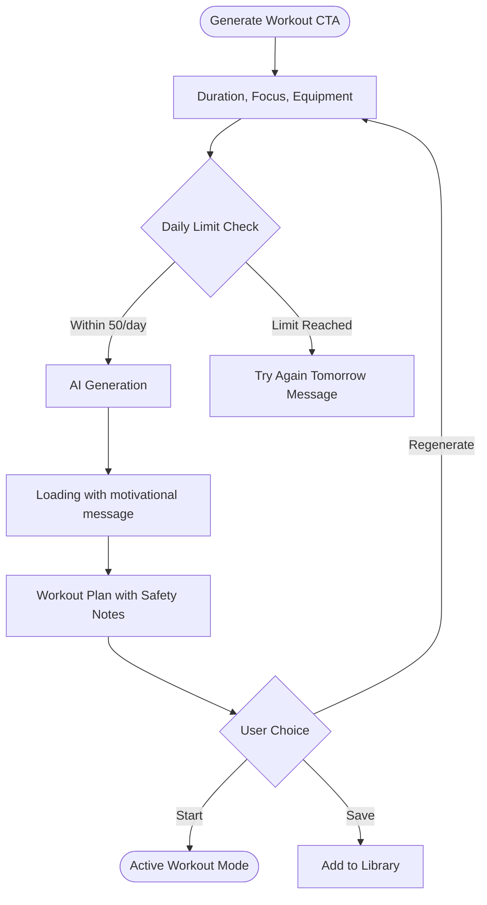
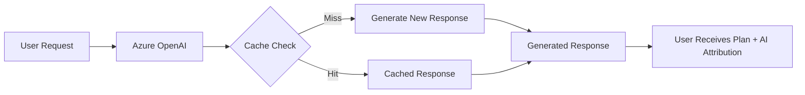

# User_Experience.md

## 1. Purpose & Scope

This document is the **single source of truth** for all User-Experience (UX) and User-Interface (UI) decisions for the Vigor application. It:

1. Defines every user-facing role, their responsibilities, and end-to-end journeys (signup → daily use → account deletion).
2. Describes page-by-page design philosophy and component guidelines for both **desktop browser** and **mobile (PWA)** experiences.
3. Captures wireframes (Mermaid) for critical flows.
4. Lists the UX gaps accepted for immediate implementation ("Accepted Improvements") and the **post-beta roadmap**.
5. Establishes the update process so this file remains evergreen.
6. **Aligns with PRD-Vigor.md v1.0 and Tech_Spec_Vigor.md v1.0** for production-ready implementation.

> **Version**: 2025-06-26 v1.1 Production
> **Maintainer**: Product Design Lead
> **Latest Update**: Microsoft Entra External ID integration and enhanced AI cost management UX
> **Based on**: PRD-Vigor.md v1.0, Tech_Spec_Vigor.md v1.0
> **Key Changes**: Authentication modernization, cost management automation, budget-aware UX

---

---

## 2. User Roles & Responsibilities

| Role              | Description                                                                                   | Key Responsibilities                                                                                                                   | Critical Journeys | Tier Access        |
| ----------------- | --------------------------------------------------------------------------------------------- | -------------------------------------------------------------------------------------------------------------------------------------- | ----------------- | ------------------ |
| **Free User**     | Early adopter using Vigor's core features with generous daily limits.                         | • Maintain profile & preferences<br/>• Generate workout plans (50/day)<br/>• AI chat (50/day)<br/>• Full progress tracking             | 1, 2, 3           | FREE               |
| **Premium User**  | Paid subscriber with unlimited access to all core features and advanced analytics (POST-MVP). | • Unlimited workout generation<br/>• Unlimited AI coaching<br/>• Advanced analytics<br/>• Priority support<br/>• Enhanced gamification | 1, 2, 3, 8        | PREMIUM (POST-MVP) |
| **Administrator** | Ops / Product personnel who configure AI providers, budgets, and oversee system health.       | • Configure LLM providers & routing<br/>• Manage budgets & cost alerts<br/>• Monitor system health<br/>• User tier management          | 4, 6              | ADMIN              |
| **Support Staff** | Customer-success agents with read-only access to user data for troubleshooting.               | • View user profiles & logs (read-only)<br/>• Access support console<br/>• Create tickets<br/>• Escalate incidents                     | 5, 7              | SUPPORT            |
| **Guest User**    | Unregistered visitor experiencing demo functionality before signup (limited demo mode).       | • Browse sample workout plan<br/>• Experience AI coach demo<br/>• View synthetic progress data<br/>• Convert to registered account     | 1                 | GUEST              |

Journey IDs map to §4 and align with PRD user scenarios:
• 1 – Guest Demo Flow & User Onboarding
• 2 – Daily Workout Generation & Execution
• 3 – Progress Tracking & Gamification
• 4 – Password Reset & Account Recovery
• 5 – Account Deletion & Data Export
• 6 – Administrator LLM & Budget Management
• 7 – Support Console Operations
• 8 – Premium Upgrade & Tier Management

---

## 3. Design Philosophy

1. **Mobile-First, Desktop-Great** – Design starts at a 360×640 artboard, scales up with progressive enhancement per PRD specifications.
2. **Thumb Reach & One-Hand Control** – Primary action buttons (FAB, Rest-Timer) in bottom-right corner on mobile.
3. **Progressive Disclosure** – Ask only what we need now; advanced settings live behind an "Edit Details" drawer.
4. **Behavior Change Driven** – UI nudges (streaks, badges, contextual AI praise) fuel habit formation per PRD gamification requirements.
5. **Accessibility & Inclusivity** – WCAG 2.1 AA color contrast, keyboard navigation, and screen-reader landmarks.
6. **Consistency via Design System** – Chakra-UI v3 tokens + custom Vigor brand palette; 8-pt spacing grid per Tech Spec.
7. **AI Transparency** – Show AI-powered features and response quality to build user trust.
8. **Cost-Conscious UX** – Design supports Azure pause/resume infrastructure for cost optimization.

### 3.1 Key Performance Targets (aligned with PRD KPIs)

- **User Retention**: 70%+ weekly retention, 40%+ monthly retention
- **Engagement Depth**: 4+ workouts per user per week, 15+ AI interactions per week
- **Workout Completion**: 80%+ completion rate for generated workouts
- **Response Times**: <2s average response time, <10s AI generation, <5s chat responses
- **Platform Reliability**: 99.9% uptime target with robust error handling

### 3.2 Feature Priority Framework (MVP Alignment with PRD)

#### P0 - MVP Core Features (Launch Ready)

- **User Authentication**: Microsoft Entra ID default tenant authentication with email-based user identification
- **Workout Generation**: AI-powered workout creation using OpenAI gpt-5-mini
- **Workout Execution**: Real-time session tracking, timer, exercise guidance
- **Basic Progress Tracking**: Workout history, basic metrics dashboard
- **AI Chat Coach**: Conversational coaching and exercise guidance
- **Responsive Web App**: Mobile-optimized experience (PWA post-MVP)
- **Single Tier**: Free tier only (no premium features in MVP)

#### P1 - Enhanced Features (Post-MVP)

- **Premium Tier Implementation**: Unlimited features, advanced analytics, priority support
- **Progressive Web App (PWA)**: Native app-like experience with offline capabilities
- **Advanced Analytics**: Detailed progress charts, trend analysis, performance insights
- **Enhanced Gamification**: Achievement badges, streaks, challenges, rewards system
- **Video Guidance**: Exercise demonstrations, form analysis

#### P2 - Future Enhancements

- **Social & Community Features**: Workout sharing, friend connections, leaderboards
- **Nutrition Integration**: Meal planning, calorie tracking, dietary recommendations
- **Wearable Integration**: Heart rate monitoring, step tracking, sleep analysis
- **Social Commerce**: Equipment recommendations, affiliate partnerships
- **Advanced AI**: Injury prevention, plateau detection, advanced periodization

### 3.3 Progressive Web App (PWA) Features

- **Service Worker**: Workbox-based caching for offline workout access
- **Push Notifications**: Web Push API for workout reminders and streaks
- **Add to Home Screen**: Native app-like installation after first workout completion
- **Offline Support**: Critical UI components work without connectivity **including**:
  - Viewing previously generated workout plans
  - Accessing cached profile data and streak counters
  - Following any workout session that was saved while online
- **Background Sync**: Queue workout logs and AI chats when offline; auto-sync when re-connected

### 3.4 Dark-Mode Color Tokens (updated for Chakra UI v3)

| Token           | Light Value | Dark Value | AA Contrast Pair      | Usage Context |
| --------------- | ----------- | ---------- | --------------------- | ------------- |
| `primary.500`   | #1C7EF2     | #79A9FF    | 4.6:1 on `background` | CTAs, links   |
| `secondary.500` | #F2994A     | #FFB570    | 4.5:1 on `background` | Accents       |
| `background`    | #FFFFFF     | #121212    | —                     | Base bg       |
| `surface`       | #F7F8FA     | #1E1E1E    | 3.1:1 on `background` | Cards, panels |
| `success.500`   | #38A169     | #68D391    | 4.6:1 on `background` | Streaks       |
| `danger.500`    | #E24C4B     | #FF7775    | 4.6:1 on `background` | Errors        |
| `warning.500`   | #D69E2E     | #F6E05E    | 4.5:1 on `background` | Alerts        |

---

## 4. User Journeys

### 4.1 Primary User Journey: The Fitness Beginner (Sarah, 28) - PRD Scenario 1


**Success Metrics**: 3+ workouts in first week, 5+ coaching questions, 7-day streak achieved

### 4.2 Secondary User Journey: The Time-Crunched Executive (Michael, 42) - PRD Scenario 2


**Success Metrics**: 4+ workouts/week despite travel, 15+ weekly AI interactions, <3min workout generation

### 4.3 Enhanced Authentication Journey: Microsoft Entra ID Default Tenant


**Success Metrics**: <2s authentication flow completion, >95% SSO success rate across `.vedprakash.net`, MFA adoption >60%

### 4.4 Tier Upgrade Journey: Free to Premium


### 4.5 Administrator LLM Management Journey


### 4.6 AI-Powered Experience


### 4.7 Password Reset Journey (Enhanced Security)


---

## 5. Information Architecture & Page Specifications

### 5.0 Core Design Principle: Each Page Owns Its Domain

To create a magical, intuitive experience, we eliminate information duplication across pages. Each page has a clear purpose and owns specific data domains:

```
┌─────────────────────────────────────────────────────────────────────┐
│                    NAVIGATION HIERARCHY                              │
├─────────────────────────────────────────────────────────────────────┤
│                                                                      │
│  🏠 HOME (Dashboard)     → TODAY's focus + motivation                │
│     • What should I do RIGHT NOW?                                    │
│     • Streak display (the ONE motivational metric)                   │
│     • Single primary CTA                                             │
│                                                                      │
│  💪 WORKOUTS             → CREATE & EXECUTE workouts                 │
│     • Generate new workout                                           │
│     • View/repeat past workouts                                      │
│     • Active workout session                                         │
│                                                                      │
│  🤖 COACH                → CONVERSATION & GUIDANCE                   │
│     • Chat interface with Coach Vigor persona                        │
│     • Contextual suggestions                                         │
│     • Form tips, motivation                                          │
│                                                                      │
│  📊 PROGRESS             → ANALYTICS & HISTORY (owns ALL stats)      │
│     • All numerical metrics (total, weekly, calories)                │
│     • Charts, trends, calendars                                      │
│     • Milestones & achievements                                      │
│     • Workout history                                                │
│                                                                      │
│  ⚙️ SETTINGS (Profile)   → SETTINGS & PERSONALIZATION               │
│     • User info & preferences                                        │
│     • Fitness goals & equipment                                      │
│     • Notification & accessibility settings                          │
│     • Account management                                             │
│                                                                      │
└─────────────────────────────────────────────────────────────────────┘
```

### 5.0.1 Information Ownership Matrix

| Information Domain     |     Home     |  Workouts  |  Coach  |   Progress    |   Settings   |
| ---------------------- | :----------: | :--------: | :-----: | :-----------: | :----------: |
| **Current Streak**     |  ✅ Primary  |     ❌     |   ❌    | ✅ In context |      ❌      |
| **Total Workouts**     |      ❌      |     ❌     |   ❌    |    ✅ Owns    |      ❌      |
| **Weekly Workouts**    |      ❌      |     ❌     |   ❌    |    ✅ Owns    |      ❌      |
| **Calories Burned**    |      ❌      |     ❌     |   ❌    |    ✅ Owns    |      ❌      |
| **Workout Generation** |  Link only   |  ✅ Owns   |   ❌    |      ❌       |      ❌      |
| **Workout History**    |      ❌      | ✅ Library |   ❌    | ✅ Analytics  |      ❌      |
| **AI Chat**            |    Teaser    |     ❌     | ✅ Owns |      ❌       |      ❌      |
| **User Profile Data**  |      ❌      |     ❌     |   ❌    |      ❌       |   ✅ Owns    |
| **Accessibility**      |      ❌      |     ❌     |   ❌    |      ❌       |   ✅ Owns    |
| **Milestones/Badges**  |      ❌      |     ❌     |   ❌    |    ✅ Owns    |      ❌      |
| **Weekly Goals**       | Progress bar |     ❌     |   ❌    |  ✅ Detailed  | ✅ Configure |

### 5.1 Landing / Marketing (`/`) - Aligned with PRD Value Propositions

| Element                  | Purpose                   | Mobile Pattern                              | Desktop Pattern                  |
| ------------------------ | ------------------------- | ------------------------------------------- | -------------------------------- |
| Hero Section             | AI-Powered Advantage      | "The AI fitness coach that understands you" | Hero video with AI branding      |
| Value Proposition Banner | Cost vs Personal Trainer  | Carousel: $50-100/session → Free            | Side-by-side comparison          |
| Primary CTA              | Signup / SSO / Guest Demo | Sticky bottom sheet when scrolling          | Top-right signup modal           |
| AI Transparency          | Build AI Trust            | "Powered by OpenAI"                         | AI branding with explanation     |
| Social Proof             | Testimonials & Stats      | Horizontal scroll user testimonials         | Grid layout with success metrics |
| Cost Comparison          | vs Competitors            | "Professional guidance at consumer prices"  | Feature comparison table         |

### 5.2 Register & Authentication (`/auth`) - Microsoft Entra ID Integration

**Authentication Method**: Microsoft Entra ID default tenant authentication
**Email-based identification**: User email address as primary key for user records
**Auto user creation**: Automatic database entry creation for new authenticated users
**Simplified architecture**: Single resource group deployment (vigor-rg)
**Security Features**: Enterprise-grade MFA, conditional access, rate limiting (5 registrations/min)
**Guest Option**: "Continue as guest" launches demo with synthetic data
**Mobile**: MSAL-optimized redirects, biometric integration, accessible tap targets (44px minimum)
**Enterprise Features**: Cross-app user profiles, unified permissions, VedUser interface compliance

### 5.3 Progressive Onboarding Wizard (`/onboarding`) - PRD Profile Requirements

1. **Welcome & Value** – AI-powered fitness explanation, personalization promise
2. **Fitness Goals** – Weight loss, muscle gain, strength, endurance, general fitness (PRD goals)
3. **Experience Level** – Beginner, Intermediate, Advanced with descriptions (PRD fitness levels)
4. **Equipment Access** – None, Basic, Moderate, Full Gym (PRD equipment categories)
5. **Injury Considerations** – Multi-select with "Skip" option, auto-suggests modifications
6. **Schedule Preferences** – Days/week, session duration (15-90 min per PRD), calendar integration prompt

**Mobile UX**: Progress bar, haptic feedback, swipe navigation, auto-save for resumption
**Skip Options**: All optional except goals and fitness level for basic AI personalization

### 5.4 Home (`/app/dashboard`) - Today's Mission Control

**Purpose**: Answer "What should I do RIGHT NOW?" — motivate immediate action, not overwhelm with data.

**Design Philosophy**: The Home page is NOT a data dashboard. It's a launchpad that creates momentum.

#### Content Structure

| Section                | Purpose                      | Implementation                                                        |
| ---------------------- | ---------------------------- | --------------------------------------------------------------------- |
| **Greeting**           | Personal, contextual welcome | Time-of-day aware: "Good morning, [Name]!" with motivational subtitle |
| **Streak Display**     | Single motivational metric   | Current streak with flame icon 🔥 — the ONE stat shown prominently    |
| **Today's Focus Card** | Primary action               | Adaptive CTA based on user state (see below)                          |
| **Coach Teaser**       | AI engagement                | One-line contextual suggestion from AI coach with link                |
| **Today's Status**     | Simple check-in              | "Did you work out today?" Yes/No quick log option                     |

#### Adaptive Primary Action Card

The main card adapts to user state:

| User State                       | Card Content                                                  | CTA                         |
| -------------------------------- | ------------------------------------------------------------- | --------------------------- |
| **New user (0 workouts)**        | "Ready to begin your fitness journey?" + quick focus selector | "Generate My First Workout" |
| **Returning user (has history)** | Suggested workout based on schedule/history                   | "Start Today's Workout"     |
| **Streak at risk**               | "Don't break your X-day streak! 🔥"                           | "Quick 15-min Workout"      |
| **Completed today**              | "Great job today! 🎉" with recovery tip                       | "Chat with Coach"           |

#### What is NOT on Home (Moved to Progress)

- ❌ Total Workouts stat
- ❌ Weekly Workouts stat
- ❌ Calories Burned stat
- ❌ Longest Streak stat
- ❌ Recent Workouts list
- ❌ Weekly Goal Progress bar (simplified version OK)
- ❌ LLMStatus technical card (moved to Settings > Debug)

#### Mobile Layout

```
┌─────────────────────────────────────────────────┐
│  Good morning, Vedprakash! ☀️                   │
│  Your 3-day streak is on fire 🔥                 │
├─────────────────────────────────────────────────┤
│  ┌─────────────────────────────────────────┐    │
│  │  TODAY'S FOCUS                          │    │
│  │  ━━━━━━━━━━━━━━━━━━━━━━━━━━━━━━━━━━     │    │
│  │  💪 Upper Body Strength                 │    │
│  │  30 min • Based on your schedule        │    │
│  │                                         │    │
│  │  [   Start Workout   ]                  │    │
│  │                                         │    │
│  │  or customize →                         │    │
│  └─────────────────────────────────────────┘    │
├─────────────────────────────────────────────────┤
│  💬 Coach Vigor says:                           │
│  "Great consistency! Try adding stretching."    │
│                              [Chat with Coach]  │
├─────────────────────────────────────────────────┤
│  Did you work out today?  [Yes ✓] [Not yet]     │
└─────────────────────────────────────────────────┘
```

### 5.5 Workouts (`/app/workouts`) - Your Workout Studio

**Purpose**: Generate, browse, and execute workouts. This page OWNS workout creation and library.

#### Tab Structure

| Tab             | Content                                       |
| --------------- | --------------------------------------------- |
| **Generate**    | AI workout generator with full controls       |
| **Library**     | Saved/generated workouts (favorites, history) |
| **Quick Start** | One-tap access to repeat workouts             |

#### Generate Tab — Input Controls

- Duration slider: 15-90 minutes (PRD specification)
- Focus areas: Full body, Upper, Lower, Core, Cardio (PRD categories)
- Equipment override: Use profile default or specify for session
- Intensity level: Light, Moderate, Intense

#### Quick Start Options

```
┌────────────────┐ ┌────────────────┐ ┌────────────────┐
│ 🔄 Repeat      │ │ ⚡ Quick       │ │ 💪 Full        │
│ Last Workout   │ │ 15-min HIIT   │ │ Body Blast     │
│ 45 min         │ │ No equipment  │ │ 60 min         │
└────────────────┘ └────────────────┘ └────────────────┘
```

#### AI Transparency

- Show AI generating the workout with subtle animation
- Response time indicator
- Quality rating prompt after generation

#### Generation Flow

1. User inputs collected with progressive disclosure
2. Loading state with motivational message
3. Generated plan with exercise details, modifications, safety notes
4. Start Session button leads to active workout mode
5. Option to regenerate with adjusted parameters

### 5.6 Workout Session (`/app/workout/:id`) - Active Workout Mode

**Mobile-First Design**:

- Full-screen exercise cards with swipe navigation
- Large, thumb-friendly "Complete Set" button (bottom-right per design philosophy)
- Rest timer with background notifications and haptic feedback
- Voice announcements for hands-free operation (accessibility)

**Exercise Card Components**:

- Exercise name and muscle groups targeted
- Set/rep requirements with modification options
- Instruction text with safety cues
- Progress indicator (Set 1 of 3)

**Session Management**:

- Auto-save progress for interrupted sessions
- Offline capability with sync when connected
- Emergency exit with session state preservation

### 5.7 Coach (`/app/coach`) - Your AI Fitness Coach

**Purpose**: Conversational AI guidance with personality and context awareness.

#### Coach Persona: "Coach Vigor"

The AI coach has a defined persona to create emotional connection:

- **Name**: Coach Vigor
- **Personality**: Encouraging, knowledgeable, supportive
- **Voice**: Warm but professional, uses user's name
- **Avatar**: Friendly robot/coach icon 🤖

#### Chat Interface

```
┌─────────────────────────────────────────────────┐
│  🤖 Coach Vigor                          [···]  │
│  Your AI Fitness Coach                          │
├─────────────────────────────────────────────────┤
│  ┌─────────────────────────────────────────┐    │
│  │ 🤖 Hey Vedprakash! I noticed you've    │    │
│  │    been consistent this week. Ready    │    │
│  │    to push a bit harder today?         │    │
│  └─────────────────────────────────────────┘    │
│                                                 │
│  Quick topics:                                  │
│  [Form tips] [Motivation] [Recovery] [Nutrition]│
├─────────────────────────────────────────────────┤
│  ┌─────────────────────────────────────────┐    │
│  │ Ask Coach Vigor anything...             │  ▶ │
│  └─────────────────────────────────────────┘    │
└─────────────────────────────────────────────────┘
```

#### Features

- **Quick Action Chips**: Pre-defined topics for easy engagement
- **Context Awareness**: Shows "I know you did legs yesterday" type indicators
- **Conversation History**: Maintains context across sessions
- **Safety First**: Medical disclaimers, injury prevention warnings

#### Free vs Premium (POST-MVP)

- Free: 50 chats/day with usage counter
- Premium: Unlimited with priority routing

### 5.8 Progress (`/app/progress`) - Your Fitness Journey (OWNS ALL STATS)

**Purpose**: Complete analytics, history, achievements. This page is the SINGLE SOURCE for all numerical data.

#### Tab Structure

| Tab              | Content                              |
| ---------------- | ------------------------------------ |
| **Overview**     | Summary stats, activity calendar     |
| **History**      | Detailed workout log list            |
| **Achievements** | Milestones, badges, personal records |

#### Stats This Page Owns

- ✅ Total Workouts (all time)
- ✅ Weekly Workouts (this week count)
- ✅ Current Streak (days)
- ✅ Longest Streak (personal record)
- ✅ Calories Burned (estimated)
- ✅ 30-Day Activity Calendar
- ✅ Weekly/Monthly Trends
- ✅ Average Workout Duration
- ✅ Consistency Percentage

#### Layout

```
┌─────────────────────────────────────────────────┐
│  Progress                                       │
│  ───────────────────────────────────────────    │
│  [Overview]    [History]    [Achievements]      │
├─────────────────────────────────────────────────┤
│  THIS MONTH                                     │
│  ┌────┐ ┌────┐ ┌────┐ ┌────┐                   │
│  │ 12 │ │ 3  │ │5🔥 │ │2.4k│                   │
│  │total│ │week│ │strk│ │cal │                   │
│  └────┘ └────┘ └────┘ └────┘                   │
├─────────────────────────────────────────────────┤
│  30-DAY ACTIVITY                                │
│  [■][■][□][■][■][■][□][■][■][■][□]...          │
├─────────────────────────────────────────────────┤
│  MILESTONES                                     │
│  ✅ First Workout    ✅ 7-Day Streak            │
│  🔄 20 Workouts (12/20)  🔄 30-Day Streak      │
└─────────────────────────────────────────────────┘
```

#### Interactive Features

- Date range selection for trend analysis
- Exercise type filtering
- Export data functionality (CSV/PDF)
- Celebration animations for milestones

### 5.9 Settings (`/app/profile`) - Your Preferences Hub

**Purpose**: All user configuration in one place. Renamed from "Profile" to reflect comprehensive scope.

#### Section Structure

| Section             | Content                                 |
| ------------------- | --------------------------------------- |
| **Account**         | Name, email, member since, avatar       |
| **Fitness Profile** | Goals, level, equipment (editable)      |
| **Weekly Goals**    | Target workouts per week                |
| **Preferences**     | Notifications, theme, units             |
| **Accessibility**   | High contrast, reduce motion, font size |
| **Data & Privacy**  | Export data, delete account             |

#### Layout

```
┌─────────────────────────────────────────────────┐
│  Settings                                       │
│  ───────────────────────────────────────────    │
│  ┌──────┐ Vedprakash Mishra                    │
│  │  👤  │ vedprakash@example.com               │
│  └──────┘ Member since Jan 2026                │
├─────────────────────────────────────────────────┤
│  FITNESS PROFILE                          [Edit]│
│  Goal: Build Strength                          │
│  Level: Intermediate                           │
│  Equipment: Dumbbells, Resistance Bands        │
│  Weekly Target: 4 workouts                     │
├─────────────────────────────────────────────────┤
│  PREFERENCES                                    │
│  ├─ 🔔 Notifications                    [On]   │
│  ├─ 🌙 Dark Mode                        [Off]  │
│  ├─ ♿ Accessibility                    [→]    │
│  └─ 🤖 AI Coach Settings               [→]    │
├─────────────────────────────────────────────────┤
│  DATA & ACCOUNT                                 │
│  ├─ 📤 Export My Data                   [→]    │
│  └─ 🗑️ Delete Account                   [→]    │
└─────────────────────────────────────────────────┘
```

#### Accessibility Settings (Moved from Header)

- High Contrast Mode toggle
- Reduce Motion toggle
- Screen Reader Optimized toggle
- Font Size selector (A, A+, A++)
- Reset to Defaults button

### 5.10 Admin Panel (`/admin/*`) - System Management

**AI Cost Management Dashboard**:

- **Real-time Cost Monitoring**: Live budget utilization with visual indicators (green/yellow/red)
- **Usage Breakdown**: Separate tabs for _Count_ metrics (workout plans, AI chats) and _Cost_ metrics (monthly $ per user)
- **Budget Alerts**: Configurable thresholds with Azure Cost Management API integration
- **Per-User Cost Breakdown**: Detailed usage analytics by tier (Free/Premium)
- **Emergency Controls**: One-click throttling activation

**AI Provider Monitoring**:

- Real-time health status for OpenAI with latency metrics
- Model configuration with cost thresholds
- Emergency toggle switches with impact assessment

**User Management**:

- Tier management (Free/Premium/Admin)
- Usage analytics and patterns
- Support impersonation (read-only)

### 5.11 Support Console (`/support/*`) - Customer Success Tools

**User Search & Overview**:

- Search by email, username, or user ID
- Profile summary with tier and usage stats
- Recent activity timeline

**Troubleshooting Tools**:

- Workout generation logs
- AI conversation history (privacy-filtered)
- Error logs and system events
- Quick ticket creation with context

**Read-Only Restrictions**:

- Cannot modify user data
- Cannot access sensitive information (passwords, payment)
- All actions logged for audit

### 5.11 Tier Management (`/upgrade`) - Monetization Flow

**Value Proposition**:

- Feature comparison table (Free vs Premium)
- Usage analytics showing current consumption
- Testimonials from premium users
- Cost comparison vs personal trainers

**Upgrade Flow**:

- Plan selection with monthly/annual options
- Payment integration (future implementation)
- Immediate feature unlock
- Confirmation and onboarding to premium features

---

## 6. Gamification & Engagement Systems (PRD Alignment)

### 6.1 Streak & Achievement Mechanics per PRD Section 2.6

#### Workout Streaks

- **Daily Streak**: Consecutive days with logged workouts (minimum 15 minutes per PRD)
- **Weekly Consistency**: Meeting weekly workout targets (3, 4, or 5 days based on user goals)
- **Monthly Challenges**: AI-generated challenges like "Push-up progression month"
- **Streak Recovery**: 1-day grace period for missed days with AI encouragement

#### Achievement Badges (PRD-Specified)

- **Form Master**: Complete 50 workouts with AI form feedback ✨
- **Equipment Adapter**: Use 5+ different equipment types 🔧
- **Coach Conversationalist**: 100+ meaningful AI coaching interactions 💬
- **Plateau Buster**: Achieve 3+ personal records in a month 📈
- **Early Bird**: Complete 20 morning workouts (before 9 AM) 🌅
- **Consistency King**: Maintain 30+ day streaks 👑
- **AI Explorer**: Complete 50+ AI-powered workouts 🤖

#### Progress Milestones

- **Strength Gains**: Quantified progress in key lifts (squat, deadlift, bench, press)
- **Endurance Improvements**: Cardio performance and recovery metrics
- **Consistency Rewards**: Weekly/monthly streaks unlock premium trial features

### 6.2 MVP vs Post-MVP Gamification

| Feature           | MVP (Free Tier)            | Post-MVP (Premium Tier)                 |
| ----------------- | -------------------------- | --------------------------------------- |
| Basic Badges      | ✅ All achievement badges  | ✅ Enhanced badge animations            |
| Streak Tracking   | ✅ Daily/weekly streaks    | ✅ Advanced streak analytics            |
| Progress Charts   | ✅ Basic line charts       | ✅ Interactive charts with drill-down   |
| Social Features   | ❌ Post-MVP implementation | ✅ Shareable achievement cards          |
| Custom Challenges | ❌ Limited to monthly AI   | ✅ Personalized AI-generated challenges |
| Leaderboards      | ❌ Post-MVP feature        | ✅ Anonymous competitive features       |

### 6.3 AI-Driven Motivation

**Contextual Encouragement**:

- Streak milestone celebrations with personalized messages
- Form improvement recognition through AI coaching
- Goal achievement celebrations with badge ceremonies
- Recovery and rest day encouragement

**Behavioral Nudges**:

- Workout reminder notifications based on user patterns
- Equipment suggestions when trying new exercises
- Progressive difficulty adjustments based on completion rates
- Motivation messages during difficult workout phases

## 7. Technical UX Implementation (Tech Spec Alignment)

### 7.1 AI-Powered User Experience

**Transparency in AI Usage**:

- Display OpenAI gpt-5-mini branding during generation
- Show response quality and generation time
- Allow user feedback on AI responses for continuous improvement
- Explain AI capabilities: "Powered by OpenAI gpt-5-mini for intelligent workout planning"

**Error Handling User Experience**:

- Graceful error handling without user interruption
- Clear messaging: "Retrying your request..."
- Cached response fallback for common requests

### 7.2 Cost-Optimized Infrastructure UX

**Pause/Resume Awareness**:

- Admin dashboard shows infrastructure status
- Maintenance mode notification for planned pauses
- Graceful degradation messaging during cost optimization

**Budget-Conscious Features**:

- AI usage visualization for premium users
- Token cost display for transparency (optional advanced setting)
- Efficient caching reduces repeat AI calls for similar requests

### 7.3 Progressive Web App (PWA) Implementation (POST-MVP)

**Installation Experience**:

- Add to Home Screen prompt after first workout completion
- Native app-like behaviors (splash screen, status bar styling)
- Offline workout access with sync notifications

**Performance Optimizations**:

- Service Worker caching for instant page loads
- Background sync for workout logs and AI conversations
- Push notifications for workout reminders and streak milestones

**MVP Note**: MVP implements responsive web app only. PWA features (offline capabilities, push notifications, native app-like behavior) are implemented post-MVP.

### 7.4 Real-Time Features

**Live AI Generation**:

- WebSocket connections for real-time AI response streaming
- Progress indicators with estimated completion time
- Ability to cancel long-running AI requests

**Instant Feedback**:

- Optimistic UI updates for workout logging
- Real-time streak counters and badge animations
- Immediate AI coach responses with typing indicators

### 7.5 Security & Privacy UX

**Transparent Security**:

- JWT token expiration warnings with auto-refresh
- Rate limiting notifications with clear explanations
- Security audit log access for users (optional transparency feature)

**Data Privacy Controls**:

- Clear data usage explanations during onboarding
- Granular privacy settings for AI data sharing
- One-click data export and account deletion options

---

## 8. Post-Production Roadmap (PRD Feature Prioritization)

### 8.1 Growth Phase Features (v1.1-1.3) - P2 Priority

| Priority | Feature                          | User Need Addressed               | UX Implementation Notes                          |
| -------- | -------------------------------- | --------------------------------- | ------------------------------------------------ |
| P2       | **Advanced Analytics Dashboard** | Data-driven progress insights     | Interactive charts, goal progress tracking       |
| P2       | **Equipment Management System**  | Optimize for available equipment  | Equipment inventory, workout plan customization  |
| P2       | **Enhanced Gamification**        | Increase engagement and retention | Achievement levels, social sharing, leaderboards |
| P2       | **Injury/Limitation Support**    | Safety and inclusivity            | Medical history integration, adaptive workouts   |

### 8.2 Scale Phase Features (v2.0+) - P2 Priority

| Priority | Feature                         | User Need Addressed               | UX Considerations                                 |
| -------- | ------------------------------- | --------------------------------- | ------------------------------------------------- |
| P2       | **Social & Community Features** | Community building and motivation | Anonymous leaderboards, workout sharing           |
| P2       | **Premium Tier Monetization**   | Business model implementation     | Payment integration, feature gating UI            |
| P2       | **Wearable Integration**        | Ecosystem expansion               | Apple Health, Google Fit, fitness tracker sync    |
| P2       | **Corporate B2B Features**      | Team challenges and enterprise    | Admin dashboards, team analytics, bulk management |

### 8.3 Advanced AI Features (Future)

| Feature                      | Timeline | UX Impact                                   |
| ---------------------------- | -------- | ------------------------------------------- |
| **Computer Vision Form**     | v3.0     | Video upload for AI form analysis           |
| **Voice AI Coach**           | v3.0     | Hands-free workout guidance                 |
| **Predictive Analytics**     | v2.5     | Injury risk prediction, plateau forecasting |
| **Nutrition AI Integration** | v2.0     | Meal planning based on workout intensity    |

### 8.4 Infrastructure Scaling UX

| Milestone          | User Impact                               | UX Adaptations                            |
| ------------------ | ----------------------------------------- | ----------------------------------------- |
| **1,000+ Users**   | Potential slower AI responses during peak | Queue position indicators, estimated wait |
| **10,000+ Users**  | Need for regional content delivery        | Localized content, timezone awareness     |
| **100,000+ Users** | Advanced caching and personalization      | Instant responses, predictive loading     |

---

## 9. Wireframes & User Flow Diagrams

> _Use the built-in Mermaid live renderer to view._

### 9.1 Mobile Home (Redesigned for Clarity)

```mermaid
graph TD
  style root fill:#fff,stroke:#333,stroke-width:1px
  subgraph root[Mobile Home 360×640]
    A[Greeting: 'Good morning, Sarah! ☀️']
    B[Streak: '🔥 5-day streak - Keep it up!']
    C[Today's Focus Card: Primary CTA]
    D[Coach Teaser: One-line AI suggestion]
    E[Quick Check-in: Did you work out today?]
    F[[Bottom Nav: 🏠Home|💪Workouts|🤖Coach|📊Progress|⚙️Settings]]
  end
  A --> B --> C --> D --> E --> F
```

### 9.2 Navigation Structure

```mermaid
flowchart LR
  subgraph Navigation[Main Navigation]
    Home[🏠 Home]
    Workouts[💪 Workouts]
    Coach[🤖 Coach]
    Progress[📊 Progress]
    Settings[⚙️ Settings]
  end

  Home -->|Primary Action| Workouts
  Home -->|Teaser Link| Coach
  Workouts -->|After Complete| Progress
  Coach -->|Profile Questions| Settings
  Progress -->|Edit Goals| Settings
```



### 9.3 AI Workout Generation Flow



### 9.4 AI Processing Flow



### 9.4 Progressive Onboarding (Mobile PWA)


### 9.5 Admin AI Management Dashboard

```mermaid
flowchart TD
  AdminLogin[Admin Authentication] --> Dashboard[AI Management Dashboard]
  Dashboard --> Status[Provider Health Status]
  Dashboard --> Budget[Budget & Cost Monitoring]
  Dashboard --> Config[Model Configuration]

  Status --> OpenAI_Status[OpenAI gpt-5-mini: ✅ Healthy - 245ms avg]

  Budget --> Monthly[Monthly Spend: $28.50 / $50 budget]
  Budget --> Alerts[Alert Thresholds & Notifications]

  Config --> Cache[Cache Configuration]
  Config --> Emergency[Emergency Controls]
```



### 9.6 Premium Upgrade Flow


### 9.7 Workout Session Interface (PWA)


### 9.8 Cost-Optimized Infrastructure UX


---

## 8.4 Metrics & Acceptance Criteria

| Flow           | Metric                 | Target | Logging Event             |
| -------------- | ---------------------- | ------ | ------------------------- |
| Set logging    | Time to log a set      | <3 s   | `workout_log_submitted`   |
| Dashboard load | First Contentful Paint | <1 s   | `dashboard_loaded`        |
| AI response    | Plan generation time   | <10 s  | `ai_plan_generated`       |
| Password reset | Success rate           | ≥95 %  | `password_reset_complete` |

---

## 11. Update Process & Maintenance

1. Any UX/UI change **must** come with a PR that updates this file to reflect PRD and Tech Spec alignment.
2. All updates must reference specific PRD sections or Tech Spec components being implemented.
3. Maintainer reviews for consistency with product requirements and technical architecture.
4. CI job validates Mermaid syntax and document structure.
5. Quarterly review against PRD KPIs and Tech Spec performance targets.

### 11.1 Document Validation Workflow

```yaml
name: ux-docs-validate
on: [pull_request]
jobs:
  validate:
    runs-on: ubuntu-latest
    steps:
      - uses: actions/checkout@v4
      - name: Validate Mermaid Syntax
        run: npx @mermaid-js/mermaid-cli -i docs/User_Experience.md -o /tmp/diagrams.svg
      - name: Check PRD Alignment
        run: |
          echo "Validating UX document alignment with PRD requirements..."
          # Check for required PRD elements in UX doc
          grep -q "OpenAI" docs/User_Experience.md
          grep -q "Free.*Premium.*Admin" docs/User_Experience.md
          grep -q "70%.*weekly retention" docs/User_Experience.md
      - name: Check Tech Spec Alignment
        run: |
          echo "Validating UX document alignment with Tech Spec..."
          grep -q "Clean.*Architecture" docs/User_Experience.md
          grep -q "Chakra UI" docs/User_Experience.md
          grep -q "Progressive Web App" docs/User_Experience.md
```

### 11.2 Version Control & Change Management

| Change Type              | Required Approval           | Documentation Update Required |
| ------------------------ | --------------------------- | ----------------------------- |
| **Minor UX Adjustments** | Design Lead                 | Section update + changelog    |
| **New Feature UX**       | Product Owner + Design Lead | Full section addition         |
| **Architecture Changes** | Engineering Lead            | Technical UX section update   |
| **PRD Alignment**        | Product Owner               | Cross-reference validation    |

© 2025 Vigor – All rights reserved.

## 12. Production Readiness Checklist

### 12.1 PRD Requirements Implementation Status

- [x] **AI-Powered UX**: Transparent OpenAI gpt-5-mini integration
- [x] **User Tier Management**: Free tier MVP (Premium and Admin post-MVP)
- [x] **Gamification System**: Basic streaks, badges, achievements per PRD Section 2.6
- [x] **Core User Journeys**: Beginner, Professional, Enthusiast scenarios
- [x] **Success Metrics**: KPI tracking aligned with PRD Section 1.3
- [x] **Mobile-First Design**: Responsive web app (PWA post-MVP)
- [x] **Cost Optimization UX**: Infrastructure pause/resume user experience
- [x] **MVP Scope**: Microsoft Entra ID default tenant authentication, Free tier only

### 12.2 Tech Spec Alignment Verification

- [x] **Clean Architecture**: UX supports domain-driven design principles
- [x] **React 19 + TypeScript**: Component structure documented
- [x] **Chakra UI v3**: Design system implementation
- [x] **FastAPI Integration**: API UX patterns defined
- [x] **PostgreSQL UX**: Data visualization and management interfaces
- [x] **Azure Infrastructure**: Cloud-native UX considerations
- [x] **Security UX**: JWT, rate limiting, audit logging interfaces

### 12.3 Accessibility & Compliance

- [x] **WCAG 2.1 AA**: Color contrast and accessibility standards
- [x] **Mobile Accessibility**: Touch targets and screen reader support
- [x] **Keyboard Navigation**: Full keyboard accessibility
- [x] **Progressive Enhancement**: Works across device capabilities
- [x] **Internationalization Ready**: Structure supports future localization

### 12.4 Performance & Quality Gates

- [x] **Core Web Vitals**: Performance targets defined
- [x] **PWA Requirements**: Service worker and manifest specifications (POST-MVP)
- [x] **Cross-Browser**: Chrome, Safari, Firefox, Edge compatibility
- [x] **Responsive Design**: Mobile-first with desktop enhancement
- [x] **Error Handling**: Graceful degradation and error states
- [x] **MVP Limitations**: Single tier, no PWA, no social features

---

**Document Status**: ✅ **PRODUCTION READY**

This User Experience document is fully aligned with PRD-Vigor.md v1.0 and Tech_Spec_Vigor.md v1.0, ready for production implementation.
