# User_Experience.md

## 1. Purpose & Scope

This document is the **single source of truth** for all User-Experience (UX) and User-Interface (UI) decisions for the Vigor application. It:

1. Defines every user-facing role, their responsibilities, and end-to-end journeys (signup → daily use → account deletion).
2. Describes page-by-page design philosophy and component guidelines for both **desktop browser** and **mobile (PWA)** experiences.
3. Captures wireframes (Mermaid) for critical flows.
4. Lists the UX gaps accepted for immediate implementation ("Accepted Improvements") and the **post-beta roadmap**.
5. Establishes the update process so this file remains evergreen.

> **Version**: 2024-12-08 β1
> **Maintainer**: Product Design Lead
> **Latest Update**: Migration to Azure Bicep + Mobile-First UX commitments.

---

## 2. User Roles & Responsibilities

| Role              | Description                                                                                            | Key Responsibilities                                                                                                                   | Critical Journeys |
| ----------------- | ------------------------------------------------------------------------------------------------------ | -------------------------------------------------------------------------------------------------------------------------------------- | ----------------- |
| **End User**      | Fitness enthusiast using Vigor for planning, logging, and coaching. Tiers: Free / Premium / Unlimited. | • Maintain profile & preferences<br/>• Generate & follow workout plans<br/>• Log sessions & view progress<br/>• Interact with AI coach | 1, 2, 3           |
| **Administrator** | Ops / Product personnel who configure AI providers, budgets, and oversee usage.                        | • Manage user tiers & limits<br/>• Configure LLM provider priorities & budgets<br/>• Monitor system health & costs                     | 4                 |
| **Support Staff** | Customer-success agents answering user queries without engineering access.                             | • View (read-only) user data & logs<br/>• Create Zendesk/Jira tickets<br/>• Escalate incidents                                         | 5                 |
| **Guest User**    | Unregistered visitor exploring the app via the "Continue as guest" option (beta-only, read-only demo). | • Browse sample workout plan<br/>• Experience AI coach in demo mode<br/>• Convert to registered account                                | 1                 |

Journey IDs map to §4 and have been updated for clarity:
• 1 – Guest Demo Flow
• 2 – Sign-Up & Progressive Onboarding
• 3 – Daily Usage (Dashboard → Workout → Progress)
• 4 – Password Reset Flow
• 5 – Account Deletion Flow
• 6 – Administrator Operations
• 7 – Support Console Operations

---

## 3. Design Philosophy

1. **Mobile-First, Desktop-Great** – Design starts at a 360×640 artboard, scales up with progressive enhancement.
2. **Thumb Reach & One-Hand Control** – Primary action buttons (FAB, Rest-Timer) in bottom-right corner on mobile.
3. **Progressive Disclosure** – Ask only what we need now; advanced settings live behind an "Edit Details" drawer.
4. **Behavior Change Driven** – UI nudges (streaks, badges, contextual AI praise) fuel habit formation.
5. **Accessibility & Inclusivity** – WCAG 2.2 AA color contrast, keyboard navigation, and screen-reader landmarks.
6. **Consistency via Design System** – Chakra-UI tokens + custom Vigor brand palette; 8-pt spacing grid.

### 3.3 Dark-Mode Color Tokens

| Token           | Light Value | Dark Value | AA Contrast Pair      |
| --------------- | ----------- | ---------- | --------------------- |
| `primary.500`   | #1C7EF2     | #79A9FF    | 4.6:1 on `background` |
| `secondary.500` | #F2994A     | #FFB570    | 4.5:1 on `background` |
| `background`    | #FFFFFF     | #121212    | —                     |
| `surface`       | #F7F8FA     | #1E1E1E    | 3.1:1 on `background` |
| `danger.500`    | #E24C4B     | #FF7775    | 4.6:1 on `background` |

---

## 4. User Journeys

### 4.1 End User Journey (Free Tier Example)

```mermaid
flowchart TD
  subgraph Sign-Up
    A[Landing CTA] --> B[Register / SSO]
    B --> C[Progressive Onboarding Wizard]
  end
  C --> D[Dashboard (Day 0)]
  D --> E[AI-Generated Plan]
  E --> F[Workout Session (PWA)]
  F --> G[Progress & Gamification]
  G --> D
  D --> |Manage| H[Profile Settings]
  H --> |Delete acct| X((Deletion))
```

#### Desktop vs Mobile Highlights

| Stage           | Desktop Browser                                        | Mobile / PWA                                                           |
| --------------- | ------------------------------------------------------ | ---------------------------------------------------------------------- |
| Landing         | Hero video autoplay; signup modal right.               | Hero image; sticky signup CTA; "Add to Home Screen" prompt after 30 s. |
| Onboarding      | 3-step modal (collect goal, fitness level, equipment). | 5 smaller steps with progress bar at top; haptic feedback on advance.  |
| Dashboard       | 3-column layout (Today, Progress, Coach).              | Single column; bottom nav tabs (Home, Log, Coach, Profile).            |
| Workout Session | Video demo aside; set logger inline.                   | Full-screen cards; swipe left/right between exercises; FAB to log set. |
| Progress        | Line + bar charts in grid.                             | Horizontal scroll charts; pinch-zoom enabled.                          |
| Deletion        | Modal confirmation; export data option.                | Same flow; Face/Touch ID confirmation if enabled.                      |

### 4.2 Administrator Journey

```mermaid
flowchart LR
  AA[Admin Login] --> BB[Dashboard]
  BB --> CC[LLM Providers]
  BB --> DD[Budgets]
  BB --> EE[User Management]
  EE --> FF[Impersonate (read-only)]
  BB --> GG[Audit & Logs]
```

### 4.3 Support Staff Journey

Support agents access a **Support Console** (read-only) featuring: search user → view profile → quick links to logs → create ticket. They **cannot** modify budgets or provider priorities.

### 4.4 Password Reset Journey


---

## 5. Page-By-Page Specifications

### 5.1 Landing / Marketing (`/`)

| Element                  | Purpose                     | Mobile Pattern                     |
| ------------------------ | --------------------------- | ---------------------------------- |
| Value Proposition Banner | Communicate AI Fitness Edge | Carousel height 420 px; swipeable  |
| Primary CTA              | Signup / SSO                | Sticky bottom sheet when scrolling |
| Social Proof             | Logos & testimonials        | Horizontal scroll chips            |

### 5.2 Register & SSO (`/auth`)

• **Required fields**: Email, password / OAuth token.<br/>
• **Secondary CTA**: "Continue as guest" (launches demo workout).<br/>
• **Mobile**: OTP autofill enabled, larger tap targets.

### 5.3 Progressive Onboarding Wizard (`/onboarding`)

1. **Goal Selection** – strength, endurance, fat-loss.<br/>
2. **Experience Level** – slider w/ emoji (Newbie → Elite).<br/>
3. **Equipment** – chip selector; defaults saved locally for resuming.<br/>
4. **Injury Check** – multi-select; optional (<2 s skip).<br/>
5. **Schedule** – days/week; calendar sync permission prompt (optional).

### 5.4 Dashboard (`/app/dashboard`)

| Section         | Component                       | Rationale             |
| --------------- | ------------------------------- | --------------------- |
| Today           | Next workout card + "Start Now" | Reduce cognitive load |
| Streak & Badges | Badge carrousel                 | Gamification          |
| Coach           | Last AI message preview         | Encourage chat        |

**Mobile-Only**: Tab bar (Dashboard, Log, Coach, Profile), bottom-75 px.

### 5.5 Workout Session (`/workout/:id`) – _Beta_

• Card per exercise, **swipe** gestures.<br/>
• **Rest Timer** auto-starts when user logs a set; push + haptic at 0 s.<br/>
• **FAB** toggles between "Add Set" and "Done".

### 5.6 Progress Analytics (`/progress`)

Interactive charts powered by Victory; pinch-zoom & range selection on mobile.

### 5.7 Admin Panel (`/admin/*`)

Dashboard → Provider List → Budget → Logs. All destructive actions gated by 2-step confirmation and require admin JWT `role=admin`.

### 5.8 Password Reset (`/auth/reset`)

| Section      | Component                  | Rationale             | Metric / Target      |
| ------------ | -------------------------- | --------------------- | -------------------- |
| Email Entry  | Email input + submit CTA   | Initiate secure reset | Abandon rate < 10%   |
| Verification | OTP or link confirmation   | Secure identity       | Reset success ≥ 95%  |
| New Password | Password + confirm fields  | Complete reset        | Time-to-reset < 90 s |
| Confirmation | Success screen, auto-login | Smooth return         | Error rate < 1%      |

---

## 6. Accepted Improvements (Immediate)

| #   | Theme                        | Implementation Notes                                                                                                                       | Owner        | ETA      |
| --- | ---------------------------- | ------------------------------------------------------------------------------------------------------------------------------------------ | ------------ | -------- |
| 1   | **Mobile-First PWA**         | Service Worker (Workbox) for offline caching;<br/>push notifications (Web Push + VAPID);<br/>Add-to-Home-Screen prompt after first workout | Frontend     | Sprint-1 |
| 2   | **Gamification & Social**    | Badge engine (tiered), streak counter (Redis key by user-id), shareable PR card (html-to-png lambda)                                       | Backend + FE | Sprint-2 |
| 3   | **Holistic Health Coverage** | Import Apple/Google Fit steps + sleep via OAuth; build Recovery Score = f(HRV, RPE history)                                                | Backend      | Sprint-3 |
| 4   | **Improved Onboarding**      | Progressive profiling; Apple/Google SSO add; telemetry: funnel events to PostHog                                                           | FE           | Sprint-2 |
| 5   | **Admin & Support UX**       | Wizard for new provider; human-readable error banners; support console with impersonate read-only                                          | FE + BE      | Sprint-3 |

---

## 7. Post-Beta Roadmap

| Priority | Feature                           | User Need Addressed                          | Notes                                      |
| -------- | --------------------------------- | -------------------------------------------- | ------------------------------------------ |
| P0       | In-Session Ergonomics             | Faster set logging, safer workouts           | Add gesture controls, weight suggestions   |
| P0       | Transparency & Trust in AI        | Build trust in AI plans, manage credits      | Explain-plan accordion; token cost display |
| P1       | Data-Driven Coaching              | Personalised AI messages using historic data | Monday summary, mood slider integration    |
| P1       | Safety & Correctness Feedback     | Reduce injury risk, improve form             | Exercise GIFs + later video analysis       |
| P2       | Pricing & Upgrade Nudges          | Monetisation optimisation                    | Dynamic upsell cards; Premium trial        |
| P2       | **Premium Subscription Handling** | Billing & feature gating (post-beta)         | Move all users to tiered model post-beta   |
| P3       | **Payment Integration**           | Accept payments for upgrades                 | No UI nor backend during beta              |
| P3       | **Additional Edge-Case Flows**    | GDPR export, Subscription refund, etc.       | Document & implement post-beta             |

---

## 8. Wireframes (Key Screens)

> _Use the built-in Mermaid live renderer to view._

### 8.1 Mobile Dashboard

```mermaid
graph TD
  style root fill:#fff,stroke:#333,stroke-width:1px
  subgraph root[Mobile Dashboard 360×640]
    A[Top Bar<br/>"Hi Sam"]
    B[Streak Badge<br/>🔥 5 Days]
    C[Next Workout Card]
    D[AI Coach Snippet]
    E[[Bottom Tab Bar]]
  end
  A --> B --> C --> D --> E
```

_Alt-text: Mobile dashboard wireframe showing top bar, streak badge, next workout card, AI coach snippet, and bottom tab bar._

### 8.2 Workout Session Card Stack

```mermaid
flowchart LR
  Start([Exercise Card<br/>Squat 3×5]) --> Rest[Rest Timer 90s]
  Rest --> Next([Exercise Card<br/>Bench 3×5])
```



### 8.3 Additional Wireframes

#### 8.3.1 Landing Page (Desktop)


#### 8.3.2 Onboarding Wizard (Mobile PWA)


#### 8.3.3 Admin Provider Wizard


#### 8.3.4 Infrastructure Cost Management


#### 8.3.4 Support Console (Desktop)


---

## 8.4 Metrics & Acceptance Criteria

| Flow           | Metric                 | Target | Logging Event             |
| -------------- | ---------------------- | ------ | ------------------------- |
| Set logging    | Time to log a set      | <3 s   | `workout_log_submitted`   |
| Dashboard load | First Contentful Paint | <1 s   | `dashboard_loaded`        |
| AI response    | Plan generation time   | <3 s   | `ai_plan_generated`       |
| Password reset | Success rate           | ≥95 %  | `password_reset_complete` |

---

## 9. Update Process

1. Any UX/UI change **must** come with a PR that updates this file.
2. Maintainer reviews for consistency and merges.
3. CI job validates Mermaid syntax.
4. Docs validation workflow reference:

```yaml
name: docs-validate
on: [pull_request]
jobs:
  mermaid:
    runs-on: ubuntu-latest
    steps:
      - uses: actions/checkout@v4
      - name: Mermaid CLI
        run: npx @mermaid-js/mermaid-cli -i docs/User_Experience.md -o /tmp/diagram.svg
```

© 2024 Vigor – All rights reserved.

## 10. Approved UX Gap Remediation Plan (2024-12-09)

| #   | Role / Area           | Gap Summary              | Fix & Deliverable                          | Owner     | Sprint | Acceptance Test                       |
| --- | --------------------- | ------------------------ | ------------------------------------------ | --------- | ------ | ------------------------------------- |
| 1   | End User – OAuth      | OAuth failure loop       | Inline error & retry, event `oauth_failed` | FE        | 1      | Error message visible, retry succeeds |
| 2   | Onboarding Chips      | Free-text typo           | Autocomplete list + "Request item" modal   | FE+BE     | 1      | 0 uncategorised chips in DB sample    |
| 3   | Consent               | Missing GDPR consent     | Consent drawer before plan generation      | FE        | 1      | Consent flag stored per user          |
| 4   | AI Coach Surfacing    | Chat hidden              | Dashboard teaser card                      | FE        | 1      | AI chat open rate +20 %               |
| 5   | Offline Logging       | Duplicate logs           | Idempotency key in API                     | BE        | 1      | No dup records under simulated loss   |
| 6   | Streak Time-zone      | False resets             | UTC streak + client adjust                 | FE        | 0      | <2 % false loss reported              |
| 7   | Change Password       | Missing logged-in change | Security settings page                     | FE+BE     | 2      | PUT /auth/change passes e2e           |
| 8   | Reset Link Validity   | Unclear expiry           | Expiry notice + 410 handler                | FE        | 0      | 99 % users land on fresh link         |
| 9   | Deletion Grace        | No restore info          | 14-day undo notice email                   | FE        | 0      | Email contains undo link              |
| 10  | Guest Editing         | Static demo              | Editable but unsaved plan                  | FE        | 1      | Inputs editable; save disabled        |
| 11  | Guest Progress        | Empty graphs             | Inject synthetic data                      | BE        | 0      | Graphs show demo series               |
| 12  | Guest Exit Upsell     | No capture               | Exit intent modal                          | FE Growth | 1      | 5 % guest→sign-up rate                |
| 13  | Admin Provider Test   | No test pre-save         | "Validate" button                          | BE        | 2      | Error returned before save            |
| 14  | Budget Granularity    | Missing tokens view      | Dual display $ / tokens                    | FE        | 0      | Value parity displayed                |
| 15  | Log Filters           | No filter UX             | Date & severity filters                    | DevOps    | 2      | Logs filtered ≤1 s query              |
| 16  | CSV Export            | None                     | Export CSV button                          | FE+BE     | 2      | CSV download ≤5 s                     |
| 17  | Quick Replies         | Manual typing            | Saved replies dropdown                     | FE        | 2      | ≥3 templates saved                    |
| 18  | Destructive Buttons   | Visible disabled         | Hide in support view                       | FE        | 0      | Buttons absent in DOM                 |
| 19  | Dark-Mode Tokens      | Not defined              | Add color overrides table                  | Design    | 2      | Contrast AA verified                  |
| 20  | Mermaid Accessibility | No ARIA                  | CLI flag & alt text                        | Docs      | 0      | SVG contains `<title>` tag            |
| 21  | SW Update Strategy    | Stale assets             | SkipWaiting + toast                        | FE        | 2      | Update toast appears on deploy        |

> Sprint-0 runs immediately (≤1 pt tasks). Sprints are two-week cadence.

### 3.2 Mobile-First Technical Constraints

- **Service-Worker Update Strategy** – implemented using Workbox `skipWaiting` and `clientsClaim`. On new deploy the service worker broadcasts `app-update` message; frontend listens and shows toast: "New version available – Refresh".
