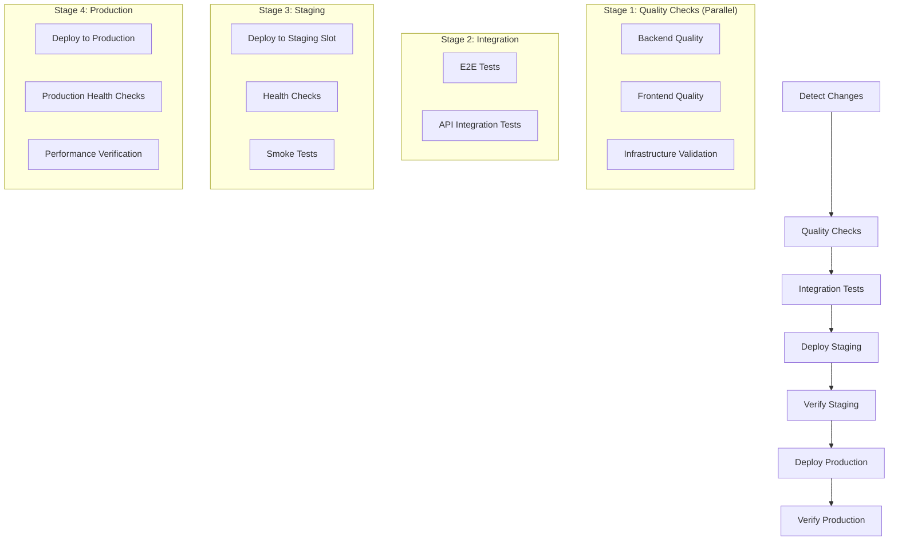

# CI/CD Pipeline Architecture - DAG Workflow Design

## 🎯 **Problem Statement**

The previous CI/CD setup had workflows running independently without proper orchestration:

- Backend and frontend CI ran separately
- No dependency management between stages
- Deployment could happen even if tests were failing
- No staging environment validation
- Missing rollback coordination

## 🔄 **New DAG-Based Architecture**

### **Workflow Stages** (Sequential Dependencies)



## 🚀 **Key Features**

### **1. Smart Change Detection**

- Uses `dorny/paths-filter` to detect what components changed
- Skips unnecessary jobs based on changed files
- Optimizes CI/CD runtime

### **2. Proper Dependencies**

```yaml
# Example: Integration tests only run after quality checks pass
integration-tests:
  needs: [backend-quality, frontend-quality]
  if: |
    always() &&
    (needs.backend-quality.result == 'success' || needs.backend-quality.result == 'skipped') &&
    (needs.frontend-quality.result == 'success' || needs.frontend-quality.result == 'skipped')
```

### **3. Staging Environment Validation**

- Deploys to staging slot first
- Runs comprehensive health checks
- Only promotes to production if staging passes

### **4. Parallel Execution Where Safe**

- Quality checks run in parallel (backend, frontend, infrastructure)
- Each component is independent during validation
- Saves time while maintaining safety

### **5. Comprehensive Failure Handling**

- Automatic issue creation on deployment failures
- Proper rollback mechanisms
- Performance monitoring

## 📊 **Benefits of DAG Approach**

### **Safety** 🛡️

- No deployment without passing tests
- Staging validation before production
- Proper dependency management

### **Efficiency** ⚡

- Parallel execution where possible
- Smart change detection
- Optimized resource usage

### **Visibility** 👁️

- Clear pipeline stages
- Easy to understand dependencies
- Better failure diagnosis

### **Reliability** 🔒

- Consistent deployment process
- Automated rollback triggers
- Performance baselines

## 🔧 **Configuration**

### **Required Secrets**

```
AZURE_CLIENT_ID
AZURE_TENANT_ID
AZURE_SUBSCRIPTION_ID
DATABASE_URL
SECRET_KEY
OPENAI_API_KEY
LLM_PROVIDER
AZURE_KEY_VAULT_URL
```

### **Environment Requirements**

- Staging and Production environments configured in GitHub
- Azure App Service with staging slots
- Proper RBAC permissions for service principal

## 📈 **Workflow Triggers**

1. **Push to main**: Full pipeline including deployment
2. **Push to develop**: Quality checks and integration tests only
3. **Pull Request**: Quality checks and integration tests
4. **Manual**: Full pipeline with manual approval gates

## 🎛️ **Rollback Strategy**

If production verification fails:

1. Automatic slot swap back to previous version
2. Issue creation for tracking
3. Notification to development team
4. Performance baseline comparison

## 📝 **Migration from Old Workflows**

1. **Backup existing workflows** (move to `.github/workflows/legacy/`)
2. **Deploy new unified pipeline**
3. **Test with feature branch**
4. **Monitor first production deployment**
5. **Remove legacy workflows** after validation

This DAG-based approach ensures proper orchestration, safety, and efficiency in the CI/CD pipeline while maintaining fast feedback loops for developers.
